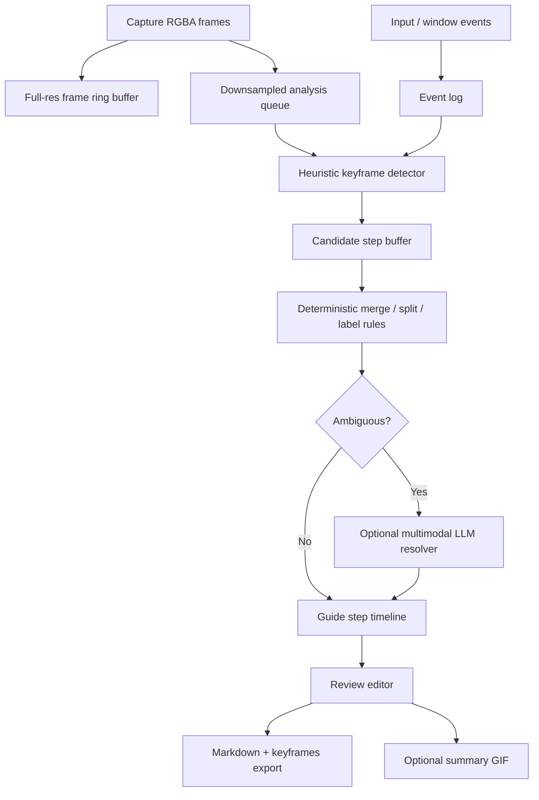

# Rollshot Action Guide Capture Roadmap

Status: Draft  
Date: 2026-06-14  
Owner: Rollshot  
Primary reference: `docs/researchs/Keyframe-Detection-for-Rollshot-from-Captured -RGBA-Desktop-Frames.md`

## 1. Summary

The most valuable recording-adjacent feature for Rollshot is not full screen recording, nor a raw GIF exporter. The highest-leverage feature is **Action Guide Capture**:

> Record one desktop workflow, detect semantic keyframes, generate editable step-by-step Markdown with screenshots, and optionally export a compact GIF preview.

The research report argues that desktop UI keyframe detection should not be treated like ordinary video shot detection. UI workflows contain tiny but semantically important changes: focus shifts, checkbox toggles, short text edits, dropdowns, toast messages, and submit/result transitions. Therefore, this roadmap uses a hybrid pipeline:

```text
input events + RGBA frames + lightweight image metrics
    -> candidate keyframes
    -> deterministic merge/split rules
    -> optional multimodal LLM resolver for ambiguous cases
    -> editable timeline
    -> Markdown / image assets / optional GIF
```

The guiding principle is:

```text
P0 should produce a useful 70% draft without any LLM.
P1/P2 should use LLMs only to improve ambiguous merge/split/label decisions.
The user must always be able to edit the result quickly.
```

## 2. Product decision

### Build this first

**Action Guide Capture**:

1. User clicks `Record Action`.
2. Rollshot records a short workflow as frames plus event metadata.
3. Rollshot detects candidate semantic steps.
4. Rollshot outputs:
   - `steps.md`
   - `keyframes/001.png`, `keyframes/002.png`, ...
   - optional `summary.gif`
5. User can review, delete, merge, split, relabel, and replace step screenshots.

### Do not build first

Avoid these as the initial product center:

- Full MP4 screen recorder.
- Pure GIF recorder from every frame.
- A fully autonomous AI agent that promises perfect SOP generation.
- A heavyweight local video understanding model.
- A GStreamer/FFmpeg-first architecture for this feature.

Those can be added later, but they are not required to validate the main user value.

## 3. Target user value

Action Guide Capture should replace this manual workflow:

```text
1. Take screenshot.
2. Paste into Markdown / Notion / GitHub issue.
3. Write step description.
4. Repeat 5-20 times.
5. Crop/annotate screenshots manually.
```

With this:

```text
1. Click Record Action.
2. Perform the workflow once.
3. Review generated steps.
4. Export Markdown.
```

The success metric is not whether Rollshot perfectly understands every UI. The success metric is whether it makes documentation, bug reports, and SOP creation much faster than manual screenshotting.

## 4. Scope

### In scope

- Short desktop workflow capture.
- Frame sampling from existing Rollshot capture infrastructure.
- Mouse, keyboard, scroll, window/app, and timing event logging where available.
- Lightweight frame-diff and perceptual metrics.
- Candidate keyframe detection.
- Typing, scroll, drag, and click burst merging.
- Markdown export with keyframe images.
- Timeline review UI.
- Optional multimodal LLM resolver for ambiguous cases.
- Optional GIF generated from final steps/keyframes, not from raw full-fps recording.

### Out of scope for MVP

- Audio recording.
- Long-duration video recording.
- MP4/WebM export.
- Pixel-perfect cross-platform accessibility tree integration.
- Real-time remote sharing.
- Automatic cloud sync.
- Full browser DOM capture unless implemented as a later extension.

## 5. Proposed architecture



### Recommended crates / modules

Add a new core crate:

```text
crates/rollshot-action/
```

Responsibilities:

- action session model
- event timeline
- frame ring buffer references
- frame metric extraction
- candidate detection
- step merging
- export model
- test fixtures and benchmark harness

Keep UI integration in:

```text
crates/rollshot-app/
```

Keep platform capture integration in:

```text
crates/rollshot-capture/
```

Optional later crates:

```text
crates/rollshot-ai/        # provider abstraction, LLM resolver, schemas
crates/rollshot-ocr/       # optional OCR backend wrapper
crates/rollshot-a11y/      # optional platform accessibility backends
```

The first implementation should avoid `opencv`, `ffmpeg-next`, and `gstreamer` unless profiling or product requirements prove they are necessary.

## 6. Core data model

The data model should make it possible to run the detector, export Markdown, and later add LLM/OCR/accessibility without rewriting the pipeline.

```rust
pub struct ActionSession {
    pub session_id: String,
    pub started_at_ms: u64,
    pub ended_at_ms: Option<u64>,
    pub capture_region: CaptureRegion,
    pub frame_refs: Vec<FrameRef>,
    pub events: Vec<ActionEvent>,
    pub candidates: Vec<CandidateStep>,
    pub guide_steps: Vec<GuideStep>,
}

pub struct FrameRef {
    pub frame_id: String,
    pub t_ms: u64,
    pub width: u32,
    pub height: u32,
    pub storage_ref: String,
}

pub enum ActionEventKind {
    MouseMove,
    Click,
    DoubleClick,
    DragStart,
    DragEnd,
    Scroll,
    Key,
    TextInput,
    FocusChange,
    WindowChange,
}

pub struct ActionEvent {
    pub t_ms: u64,
    pub kind: ActionEventKind,
    pub x: Option<f32>,
    pub y: Option<f32>,
    pub key: Option<String>,
    pub text: Option<String>,
    pub modifiers: Vec<String>,
}

pub struct FrameMetrics {
    pub t_ms: u64,
    pub luma_diff: f32,
    pub changed_area: f32,
    pub ssim_drop: Option<f32>,
    pub hist_diff: Option<f32>,
    pub cursor_masked: bool,
    pub event_bonus: f32,
    pub score: f32,
}

pub struct CandidateStep {
    pub candidate_id: String,
    pub start_ms: u64,
    pub end_ms: u64,
    pub peak_frame_id: String,
    pub score: f32,
    pub reason: CandidateReason,
    pub needs_resolver: bool,
}

pub struct GuideStep {
    pub step_id: String,
    pub order: usize,
    pub start_ms: u64,
    pub end_ms: u64,
    pub keyframe_id: String,
    pub title: String,
    pub description: Option<String>,
    pub confidence: f32,
    pub source: StepSource,
}
```

## 7. Roadmap by phase

## Phase 0 — Product spike: deterministic Action Guide MVP

Goal: prove that Rollshot can generate useful step-by-step Markdown without an LLM.

### Deliverables

- `Record Action` command behind a feature flag.
- Short action session capture.
- Full-resolution frame ring buffer.
- Downsampled analysis queue.
- Basic event log:
  - click
  - double click
  - scroll
  - key / text input where feasible
  - window/app change where feasible
- Lightweight detector:
  - cursor-masked luma diff
  - changed-area ratio
  - cooldown/debounce
  - event-backed score bonus
- Basic semantic merge rules:
  - typing burst merge
  - scroll settle detection
  - drag start/end collapse
  - repeated spinner suppression heuristic
- Export:
  - `steps.md`
  - `keyframes/*.png`
  - `session.json`
- Minimal timeline review UI:
  - view generated steps
  - delete step
  - edit step title
  - replace keyframe with nearby frame

### Detector behavior

P0 should prefer event-backed candidates over pure visual changes.

Rules:

- A click can create a candidate only if there is local visual change, focus change, window change, or a stable post-click state.
- Typing frames should merge into one step until pause, Enter, Tab, or blur.
- Scrolling should emit one step after the viewport settles, not one step per frame.
- Cursor movement alone should not create a step.
- Loading spinners and blinking carets should be suppressed unless accompanied by a meaningful UI state change.

### Example output

```markdown
# Action Guide

1. Open the Preferences window  
   

2. Select the Capture tab  
   

3. Enable Record Action  
   

4. Save the setting  
   
```

### Acceptance criteria

- Can record at least 10 representative short workflows without crashing.
- Generated Markdown includes ordered steps and valid PNG links.
- Capture thread is never blocked by detection or export.
- The user can remove or rename incorrect steps.
- Deterministic export works offline.
- No LLM/API key is required.

### Suggested PR sequence

1. Add `crates/rollshot-action` with session/event/step data types.
2. Add frame ring buffer and downsample queue integration.
3. Add event timeline model and mock event fixture tests.
4. Add luma diff and changed-area detector.
5. Add candidate debounce and merge rules.
6. Add Markdown/keyframe/session export.
7. Add minimal review UI behind feature flag.

## Phase 1 — Detector hardening and benchmark harness

Goal: make the deterministic detector measurable, tunable, and stable across real workflows.

### Deliverables

- Internal benchmark dataset:
  - 30-50 short workflows
  - labeled semantic steps
  - labeled preferred keyframe per step
  - annoying cases slice: spinner, caret, scroll, toast, modal, dropdown, rapid typing
- Offline detector runner:
  - reads `session.json` + frame assets
  - outputs predicted `guide_steps.json`
  - produces metrics report
- Metrics:
  - step precision / recall / F1
  - keyframe temporal error
  - over-segmentation rate
  - under-segmentation rate
  - user edit rate
  - CPU time per analyzed frame
  - dropped analysis frame count
- Debug artifacts:
  - per-frame score CSV
  - candidate timeline JSON
  - optional visual overlay showing changed regions and selected candidates

### Detector additions

Add only if P0 data shows clear need:

- SSIM/DSSIM-style structural score.
- Histogram delta.
- Edge-change ratio.
- Local ROI scoring around cursor/click target.
- Animated-region suppression.
- Robust rolling threshold with median/MAD.

### Acceptance criteria

- Detector quality can be compared between commits.
- At least one benchmark report is checked into `bench-results/compare/` or a similar location.
- P0 detector thresholds are no longer hardcoded throughout the codebase; they are centralized in a config object.
- Regressions in step count and edit rate can be detected from fixtures.

### Suggested PR sequence

1. Add `ActionDetectorConfig` and central threshold config.
2. Add offline replay runner for saved sessions.
3. Add benchmark fixture format and sample fixtures.
4. Add metrics report generator.
5. Add improved metrics one at a time, each with before/after report.

## Phase 2 — Optional multimodal LLM resolver

Goal: improve ambiguous cases without making the core feature dependent on cloud AI.

### Product rule

LLM is an enhancer, not the primary detector.

```text
Strong deterministic candidate -> keep without LLM.
Obvious noise -> drop without LLM.
Ambiguous cluster -> ask LLM to merge/split/label.
LLM unavailable -> deterministic fallback still exports usable Markdown.
```

### Deliverables

- `ActionResolver` trait.
- `DeterministicResolver` implementation.
- `MultimodalLlmResolver` behind feature flag.
- Compact evidence package:
  - before frame
  - peak frame
  - after frame
  - cursor/click crop
  - changed-region crop
  - local event log
  - detector scores
- Strict JSON schema for resolver output.
- Rate limiting and timeout fallback.
- Redaction/privacy hooks.
- User setting:
  - `Local only`
  - `Ask before AI resolution`
  - `Use AI for ambiguous steps`

### LLM should handle

- Merge 2-5 nearby candidates into one semantic step.
- Split a candidate if two obvious user intents occurred.
- Label a step in natural language.
- Choose the best keyframe among before/peak/after.
- Drop non-semantic animation-only candidates.

### LLM should not handle

- Continuous every-frame analysis.
- Long raw video upload.
- Private screen upload without explicit user consent.
- Primary event detection.
- Irreversible edits to the session.

### Acceptance criteria

- LLM call rate is bounded and visible in diagnostics.
- Turning LLM off still produces a valid guide.
- LLM responses are schema-validated.
- Failed or timed-out LLM calls do not block export.
- Ambiguous test cases show lower edit rate than deterministic-only mode.

### Suggested PR sequence

1. Add resolver trait and deterministic resolver.
2. Add evidence package builder.
3. Add JSON schema and response validation.
4. Add mock LLM resolver tests.
5. Add provider-backed resolver behind feature flag.
6. Add privacy/consent UI.
7. Add A/B benchmark: deterministic vs LLM-assisted.

## Phase 3 — OCR and accessibility signals

Goal: improve detection and labeling for tiny semantic UI changes.

### Deliverables

- Optional ROI OCR module.
- OCR only on focused/changed/cursor-local regions, not full frame by default.
- Text delta signal.
- Platform accessibility spike:
  - macOS: AXUIElement-based focused element/value snapshot.
  - Windows: UI Automation focused element/value snapshot.
  - Linux: AT-SPI focused element/value snapshot where available.
- Accessibility signal abstraction:
  - role
  - name
  - value
  - bounds
  - focused state
  - selected state

### Product constraints

- Accessibility must be optional and permission-aware.
- OCR must be rate-limited.
- The feature must not fail if OCR or accessibility is unavailable.
- Screenshots remain the source of truth for export.

### Acceptance criteria

- Text input and small validation messages are detected more reliably.
- Checkbox/toggle/focus changes can be detected even with low visual diff.
- Permission failure has a clear UI explanation and fallback.
- OCR CPU cost is visible in diagnostics.

### Suggested PR sequence

1. Add OCR signal interface and no-op backend.
2. Add ROI extraction around cursor and changed regions.
3. Add one OCR backend behind feature flag.
4. Add accessibility snapshot interface and no-op backend.
5. Add one platform spike, preferably macOS first if Rollshot's current app focus is macOS-heavy.
6. Feed OCR/a11y deltas into candidate scoring.
7. Re-run benchmark and document quality/cost tradeoff.

## Phase 4 — Export quality and sharing

Goal: make the generated guide useful outside Rollshot.

### Deliverables

- Markdown templates:
  - bug reproduction
  - SOP/tutorial
  - release note/demo
  - QA test case
- Better image assets:
  - full keyframe
  - optional crop around action target
  - optional cursor/click marker
  - optional redaction boxes
- Export formats:
  - Markdown folder
  - single HTML file
  - clipboard copy
  - GitHub issue body
  - optional summary GIF from selected steps
- Per-step metadata:
  - timestamp
  - confidence
  - source: heuristic / deterministic resolver / LLM resolver / user-edited

### GIF strategy

Do not generate GIF from the full raw recording in this phase.

Generate a compact summary GIF from final guide steps:

```text
final guide steps -> selected keyframes -> captions/click markers -> summary.gif
```

This keeps file size predictable and reinforces the core value: workflow summary, not video recording.

### Acceptance criteria

- Exported Markdown works when opened outside Rollshot.
- Image paths are portable and relative.
- User can copy a guide into GitHub/Notion with minimal cleanup.
- GIF generation is optional and does not block Markdown export.

## Phase 5 — Performance, local models, and long-term backend options

Goal: scale the feature while preserving responsiveness and privacy.

### Possible investments

- GPU-accelerated image metrics via `wgpu` if CPU becomes bottleneck.
- Local ONNX model for UI-specific candidate ranking if a dataset exists.
- Browser extension or browser-specific connector for DOM-backed workflows.
- Native MP4/WebM recording backend if users explicitly need full recordings.
- Cloud/project sharing if guides become a collaboration artifact.

### Decision gates

Do not invest in these until metrics justify them:

- Add `opencv` only if ORB/optical-flow metrics measurably reduce edit rate.
- Add `ffmpeg`/MP4 only if users ask for full recording, not just guide export.
- Add local VLM only if LLM-assisted mode is valuable but cloud privacy/cost blocks usage.
- Add full accessibility tree capture only if focused-element snapshots prove valuable.

## 8. Key product UX

### Entry point

Add a command separate from normal screenshot:

```text
Record Action Guide
```

Avoid naming it simply `Record Video`, because that creates expectations around MP4, long-duration capture, audio, and high-FPS playback.

### Review UI

The review UI should be treated as part of the core feature, not polish.

Minimum UI:

```text
Left: ordered step list
Right: selected keyframe preview
Bottom: nearby frame scrubber
Actions: rename, delete, merge with previous, split here, replace keyframe, export
```

### Why editor matters

This feature will always have false positives and false negatives. The correct product promise is:

```text
Rollshot creates a good first draft.
The user can fix it quickly.
```

Not:

```text
Rollshot perfectly understands every workflow automatically.
```

## 9. Benchmark and quality gates

### Offline metrics

Track these for every detector revision:

- step precision
- step recall
- step F1
- temporal keyframe error
- over-segmentation rate
- under-segmentation rate
- duplicate step rate
- noise candidate rate
- deterministic vs LLM-assisted edit rate

### Product metrics

Track these from dogfooding sessions:

- time from stop recording to generated draft
- number of generated steps
- number of deleted steps
- number of renamed steps
- number of merged/split steps
- final accepted steps
- export success rate
- user edit rate

Recommended primary KPI:

```text
User edit rate = edits required / final accepted steps
```

This is more product-relevant than pure detector F1.

### Performance metrics

Track:

- capture FPS stability
- analysis queue depth
- dropped analysis frames
- CPU time per frame
- peak memory
- OCR duty cycle
- LLM calls per minute
- LLM timeout/fallback rate

## 10. Privacy and safety requirements

Action Guide Capture may record sensitive screen content. Privacy controls should be explicit from the beginning.

### MVP privacy requirements

- Store sessions locally by default.
- Do not call LLM unless user enables AI resolution.
- Make AI mode visibly distinct from local-only mode.
- Allow the user to delete a session and all generated assets.
- Avoid logging raw OCR text or frame contents in diagnostics unless explicitly enabled.

### Later privacy features

- Redaction before export.
- Redaction before LLM upload.
- Local-only mode lock.
- Per-app exclusion list.
- Auto-detect password fields where accessibility/OCR signals can identify them.

## 11. Risks and mitigations

| Risk | Impact | Mitigation |
|---|---|---|
| Too many false positive steps | Generated guide feels noisy | Event-backed candidates, cooldown, spinner/caret suppression, editor delete action |
| Missing subtle UI steps | Guide skips important operations | OCR/a11y in later phases, LLM resolver for low-visual-change candidates |
| Capture thread stalls | App feels broken | Bounded queues, never block capture on detector/export/LLM |
| LLM cost or latency grows | Feature becomes expensive or slow | Ambiguity-only LLM policy, batching, rate limits, deterministic fallback |
| Privacy concerns | Users avoid feature | Local-only default, explicit AI consent, redaction hooks |
| Cross-platform event capture is inconsistent | Uneven quality across OSes | Stable frame-based fallback, platform capability flags, diagnostics |
| Editor is underbuilt | AI mistakes feel fatal | Make delete/rename/merge/split/replace first-class in P0/P1 |
| GIF distracts from core value | Roadmap becomes a recorder project | Generate GIF only from final guide steps, keep Markdown as primary output |

## 12. Open decisions

1. Should the first UI ship only in `rollshot-app`, or also expose a CLI replay/export path?
2. What is the initial maximum session length: 30 seconds, 60 seconds, or configurable?
3. Should P0 store every sampled full-res frame, or only frame refs around candidates?
4. Should the default export language be English, Chinese, or follow OS locale?
5. Should AI-generated labels be opt-in per session or global setting?
6. Should browser workflows eventually use a Chrome extension for DOM/a11y-rich capture?
7. Should session assets live in Rollshot's existing storage layout or a new `action_sessions/` directory?

## 13. Recommended implementation order

The most practical order is:

```text
1. Action session data model
2. Frame ring buffer + downsampled analysis queue
3. Event log
4. Heuristic detector
5. Candidate merge rules
6. Markdown/keyframe export
7. Minimal review editor
8. Benchmark fixtures
9. LLM resolver
10. OCR/a11y signals
11. Summary GIF
```

Do not start with LLM, OCR, GIF, or MP4. The foundation is the session timeline plus editable guide export.

## 14. Definition of done for MVP

MVP is done when a developer can use Rollshot to record a short workflow and get a useful Markdown guide.

Required:

- `Record Action Guide` can be started and stopped.
- Generated guide has at least one step per meaningful user intent in simple workflows.
- Generated screenshots are readable and linked correctly.
- User can delete and rename steps before export.
- Markdown export works without cloud services.
- Capture remains responsive.
- At least 10 dogfooding sessions are saved as fixtures.

Not required:

- perfect step labels
- LLM integration
- OCR
- accessibility APIs
- GIF
- MP4
- audio

## 15. Recommended document placement

Suggested path for this roadmap:

```text
docs/feature-discovery/2026-06-14-action-guide-capture-roadmap.md
```

Keep the detailed algorithm research in:

```text
docs/researchs/Keyframe-Detection-for-Rollshot-from-Captured -RGBA-Desktop-Frames.md
```

If this moves from discovery to implementation, create a companion implementation plan under:

```text
docs/superpowers/plans/2026-06-14-action-guide-capture.md
```

This roadmap should remain the product/engineering strategy document. The superpowers plan should contain concrete patch order, files to edit, tests to add, and rollback strategy.
