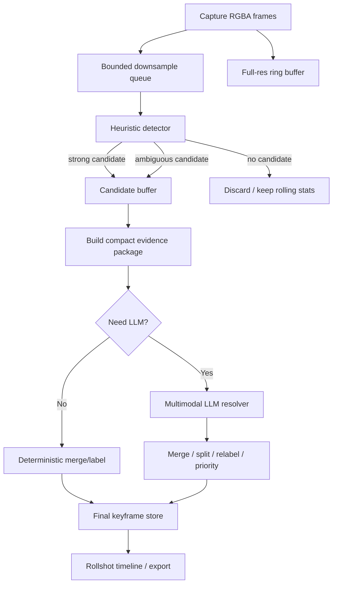

# Keyframe Detection for Rollshot from Captured RGBA Desktop Frames

## Executive summary

Desktop UI recordings are a different problem from ordinary video shot detection. In GUI recordings, semantically important changes can be tiny and fast: a cursor click, a caret move, a dropdown opening, a text field updating, or focus moving between controls. GUI-World explicitly reports that current models struggle with dynamic GUI content without keyframes or operation history, and its data pipeline resorted to **manual** keyframe extraction because existing keyframe algorithms often miss GUI-relevant changes as small as slight cursor motion. GUI Action Narrator makes the same point from another angle: GUI events are denser, subtler, and temporally tighter than natural-scene video, and adding cursor-aware keyframe selection improves captioning performance. citeturn26view0turn25view3turn24view0

The most effective design for Rollshot is therefore **not** “pick one algorithm.” It is a **multi-stage, multi-signal system**: fast deterministic detectors first, a small candidate buffer second, and a multimodal LLM only for cases where the signals disagree or the semantic boundary is ambiguous. That recommendation is consistent with shot-boundary literature showing that multi-feature methods generally outperform single-feature methods, and that adaptive thresholds outperform one fixed global threshold in difficult content. citeturn37view1turn17view0

A practical starting point for Rollshot is:

- Use a **hybrid heuristic detector** as the primary stage: masked luma difference, changed-area ratio, SSIM or DSSIM, histogram delta, OCR/text delta, and cursor/keyboard/focus events. For desktop UI, event and structure signals are often more valuable than raw visual change alone. citeturn30view0turn27view0turn26view0turn25view3
- Treat **cursor, keyboard, and accessibility-tree deltas as first-class inputs**. Browser accessibility trees are a subset of the DOM tree, Windows UI Automation exposes most desktop UI elements programmatically, AT-SPI exposes accessible objects on Linux, and macOS exposes accessibility objects through `AXUIElement`. citeturn33view2turn33view3turn33view5turn14search0
- Use **deep shot-boundary networks only as optional secondary tools**, not as the main detector. DeepSBD and TransNet V2 are strong for abrupt/gradual cinematic transitions, but their training target is conventional shot transition detection, not tiny semantic GUI state changes. citeturn27view2turn27view3turn26view0
- In Rust, start with **`image` + `imageproc` + `dssim-core` + event instrumentation + optional OCR**, add **`opencv`** only if you need ORB/LK optical flow, and reserve **`wgpu`** or **ONNX inference** for later optimization. Official crate docs support this layering: `image` and `imageproc` provide the basic pure-Rust image stack, `dssim-core` exposes an efficient structural-similarity core, `opencv` binds the full OpenCV library, `wgpu` is cross-platform GPU compute, and OCR bindings vary greatly in packaging complexity. citeturn31view1turn31view2turn32view0turn31view0turn31view3turn31view4turn31view5turn32view3

## Taxonomy of approaches

The literature naturally splits the problem into classical shot-boundary families, GUI-specific signal families, and semantic/model-based approaches. Classical reviews emphasize pixel/color/edge/motion features, newer deep models such as DeepSBD and TransNet V2 target general shot transitions, and screenshot-centric GUI papers such as ScreenAI, SeeClick, and CogAgent show that screen understanding benefits from UI-specialized perception rather than treating screens as ordinary video. citeturn37view1turn27view2turn27view3turn25view0turn25view1turn25view2

| Approach | Core algorithm | Typical complexity | Strengths for desktop UI capture | Weaknesses for desktop UI capture | Robustness to subtle UI changes | Sensitivity to animations | Rust implementation notes |
|---|---|---:|---|---|---|---|---|
| Heuristic image-diff | Adjacent-frame pixel/luma/histogram/edge difference, thresholding, cooldown | \(O(P)\) per frame pair, where \(P=W\times H\) | Very fast, deterministic, easy to tune, ideal as first-pass candidate generator | Misses semantically important tiny changes unless thresholds are very low; low thresholds increase false positives | Low to medium | High unless masked/adaptive | Best first step with `image`, `imageproc`, optional `rayon`; no native CV runtime required |
| Feature-based | ORB/FAST corners, descriptor matching, optical flow, inlier drop | Roughly \(O(P + K\log K + M)\), depending on detector/matcher | Better than plain pixel diff for viewport motion, drags, zooms, scrolling, and re-layout | Overkill for many static UIs; weak when only text/value changed in a tiny region | Medium | Medium | Most practical in Rust via `opencv`; ORB is fast and explicitly designed as a lower-cost alternative to SIFT/SURF citeturn38view0 |
| Motion, cursor, and interaction signals | Mouse path, click/drag/scroll, keyboard bursts, focus changes, window/app switches | Event processing is near \(O(1)\); local crop checks add small ROI cost | Excellent semantic prior; often tells you *when* to inspect frames | Requires event instrumentation; not all state changes are user initiated | High when events exist | Low if animations are not event-backed | Rollshot should treat these as native signals; combine with local visual confirmation |
| Perceptual metrics | SSIM/MS-SSIM/DSSIM, pHash/dHash, structural and edge similarity | SSIM: \(O(P)\); MS-SSIM: \(O(P\log \min(H,W))\) across scales | More robust than raw pixel diff to antialiasing/compositor noise; better for “small but structural” changes | Still blind to semantics; can stay high during important text entry or focus changes | Medium to high | Medium | `dssim-core` is the strongest current Rust option; `ssim` exists but is far less mature in documentation citeturn32view0turn32view1 |
| ML-based shot/boundary detection | 3D CNN or temporal model on frame windows | \(O(T \cdot \text{model FLOPs})\) per window | Strong for abrupt cuts, fades, dissolves, edited content | Misaligned target for desktop UI; heavier packaging/inference burden | Medium | Medium to low for cinematic transitions, but poor semantic precision for GUI micro-events | Use only if you already have a local ONNX pipeline and a desktop-tuned model |
| Unsupervised clustering | Buffer candidate frames, embed/feature them, cluster or non-max suppress, choose representatives | \(k\)-means: \(O(nkdI)\); agglomerative: often \(O(n^2)\) | Good for de-duplication and long-scroll summarization | Usually offline or delayed; weak for precise online step boundaries | Medium | Low to medium | Best as a post-processing step on candidates, not the first detector |
| Multimodal or LLM-assisted | Inspect keyframes, short clips, crops, and events; decide merge/split/label/priority | Dominated by API latency and token/image cost | Best layer for semantics, ambiguity resolution, labeling, and merge/split decisions | Expensive, slower, can hallucinate if under-constrained | High when supplied with events/crops/history | Medium if prompt contains too much irrelevant animation | Send only *small* curated payloads; GUI papers show keyframes, region focus, and cursor cues matter citeturn25view3turn12search2turn25view1turn25view2 |

For Rollshot specifically, the decisive distinction is between **visual discontinuity** and **semantic step change**. A full-frame pixel jump is often unimportant in UI capture, while a tiny text-field update can be the real step. That is why event/structure signals and OCR matter so much more here than in conventional video indexing. GUI-World explicitly notes that existing keyframe extraction algorithms usually underperform on GUI video because changes may be minimal; GUI-specific VLM work similarly emphasizes screenshots, grounding, and high-resolution element perception rather than ordinary video editing cues. citeturn26view0turn25view1turn25view2turn25view0

Deep models are still useful, but mostly in two narrower roles. First, a TransNet/DeepSBD-style transition detector can act as a **coarse guardrail** for imported recordings that actually contain hard scene transitions, app switches, or inserted media. Second, a local ONNX model can be an **optional semantic ranker** over already-generated candidates. As a primary detector for live desktop capture, though, they are usually the wrong optimization target. DeepSBD is trained on 16-frame segments for shot classes, and TransNet V2 is explicitly about fast shot transition detection on standard video benchmarks, which is not the same objective as finding micro-steps in UI workflows. citeturn27view2turn27view3

## Concrete detectors, formulas, and starting thresholds

The most effective online system is to compute cheap global signals on **downsampled luma**, compute expensive signals only on **candidates or ROIs**, and keep cursor or accessibility signals **separate** from global image change so cursor motion alone does not flood the detector.

Let \(Y_t\) be the luma image at time \(t\), \(P=W\times H\), and let all “starting thresholds” below be interpreted as **engineering priors for desktop UI capture**, not as literature constants. The literature gives the metric families and practical baselines; the threshold values below are the values I would try first in Rollshot and then tune empirically. Classical histogram-difference, edge-change, and SSIM formulations come directly from the cited work. citeturn30view0turn27view0turn29search2turn29search14turn17view0

### Frame-level signals

| Signal | Formula or definition | What it catches well | Starting threshold for Rollshot |
|---|---|---|---|
| Normalized luma \(L_1\) diff | \(\displaystyle D_t=\frac{1}{255P}\sum_{x,y}\left|Y_t(x,y)-Y_{t-1}(x,y)\right|\) after masking the cursor footprint | Large UI state changes, app switches, modal appearance | Candidate at \(D_t>0.015\); strong at \(>0.035\) |
| Changed-area ratio | Threshold diff mask \(M_t=\mathbf{1}(|Y_t-Y_{t-1}|>\tau_p)\), then \(\displaystyle A_t=\frac{1}{P}\sum M_t\) after opening/closing | Small localized updates, menus, tooltips, status badges | Candidate at \(A_t>0.008\); strong at \(>0.03\) |
| SSIM | \(\displaystyle \text{SSIM}(x,y)=\frac{(2\mu_x\mu_y+C_1)(2\sigma_{xy}+C_2)}{(\mu_x^2+\mu_y^2+C_1)(\sigma_x^2+\sigma_y^2+C_2)}\), with the original paper using \(K_1=0.01, K_2=0.03\) for \(C_1=(K_1L)^2, C_2=(K_2L)^2\) citeturn27view0 | Structural UI change that raw diff overreacts to less; good against antialiasing noise | Candidate when \(1-\text{SSIM}>0.01\); strong when \(>0.03\) |
| DSSIM or MS-SSIM-like score | Use `dssim-core`; conceptually a multi-scale structural dissimilarity measure rather than single-scale SSIM citeturn19search1turn32view0 | Better than single-scale SSIM for mixed-size UI changes | Candidate at score \(>0.006\); strong at \(>0.02\) |
| Histogram difference | Classical choice: \(\displaystyle H_t=\sum_i |h_t(i)-h_{t-1}(i)|\), or use correlation/Bhattacharyya on normalized histograms; color-histogram SBD is a standard fast baseline citeturn30view0turn17view0 | Theme/palette changes, page switches, dark/light transitions | Candidate if normalized \(H_t>0.06\); strong \(>0.15\) |
| Edge-change ratio | Let \(\sigma_t\) be edge pixels, \(X_t^{in}\) entering edges, \(X_{t-1}^{out}\) exiting edges; \(\displaystyle ECR_t=\max\!\left(\frac{X_t^{in}}{\sigma_t},\frac{X_{t-1}^{out}}{\sigma_{t-1}}\right)\). Lienhart-style ECR ranges from 0 to 1 and is often made tolerant to nearby edge displacement to reduce motion sensitivity. citeturn29search2turn29search14 | Layout changes, appearing panels, viewport jumps, structural shifts | Candidate at \(ECR_t>0.12\); strong at \(>0.25\) |
| Perceptual hash delta | Use pHash-like DCT lowpass and normalized Hamming distance; PySceneDetect’s hash detector follows this family and uses a normalized relative Hamming distance thresholding scheme. citeturn17view0 | Coarse deduplication, low-cost relative change | Candidate at distance \(>0.10\); strong at \(>0.22\) |
| Feature-match drop | ORB keypoints + Hamming matches + RANSAC homography or affine model. Define \(\displaystyle F_t=1-\frac{\#\text{inlier matches}}{\min(K_t,K_{t-1})+\epsilon}\) | Scroll, pan, drag, window movement, zoom, re-layout | Candidate at \(F_t>0.35\); strong at \(>0.55\) |
| Cursor path signal | Over a short window \([t-\Delta,t]\), path length \(\displaystyle L_t=\sum_i\|p_i-p_{i-1}\|_2\); box ratio \(\displaystyle B_t=\frac{\text{area}(\text{bbox}(P_{t-\Delta:t}))}{P}\) | Click, drag, selection rectangle, slider movement | Only meaningful with event context; e.g. click + local crop change, or drag with start/end crop delta |
| OCR/text delta | Run OCR on focused ROI or changed text ROI; normalized edit distance \(\displaystyle T_t=\frac{\text{lev}(s_t,s_{t-1})}{\max(|s_t|,|s_{t-1}|,1)}\) | Text entry, validation messages, labels, result counts | Candidate at \(T_t>0.15\) or inserted chars \(\ge 4\); strong if Enter/blur follows |
| Accessibility or DOM-like delta | Hash tuples such as `(role, name, value, bounds, focused)` over focused node and local subtree; define normalized subtree-hash delta or explicit field-change flags | Extremely important for subtle state changes with near-identical pixels | Candidate on role/name/value/focus change even if visual score is low |

A few implementation details matter more than the formulas themselves.

First, **mask the cursor** out of the global frame-diff path and treat cursor motion as a separate signal. GUI Action Narrator shows that cursor information is extremely valuable, but it should be used as a **visual prompt**, not as noise in the global metric. citeturn25view3turn24view0

Second, prefer **ROI OCR** over full-frame OCR. Tesseract defaults to page segmentation mode 3, but its own documentation recommends changing `--psm` when the input is a small crop or a specific text layout. For UI ROIs, the most useful modes are usually `6` for a single text block, `7` for a single text line, `8` for a single word, and `11` for sparse text. citeturn33view0turn33view1

Third, use **DOM-like or accessibility-tree heuristics whenever available**. In the browser, the accessibility tree is a subset of the DOM tree oriented toward assistive technology. On Windows, UI Automation provides programmatic access to most desktop UI elements; on Linux, AT-SPI exposes accessible objects, their roles, text, value, selection, and events; on macOS, `AXUIElement` is the accessibility object handle. For browser and native desktop apps alike, these signals often detect meaningful focus or value changes that are almost invisible at the pixel level. citeturn33view2turn33view3turn33view5turn14search0

### Aggregation, adaptive thresholds, and event rules

A practical online scoring rule is:

\[
S_t =
0.22\,\hat D_t +
0.18\,(1-\widehat{SSIM}_t) +
0.12\,\hat H_t +
0.10\,\hat ECR_t +
0.10\,\hat F_t +
0.12\,\hat T_t +
0.16\,\hat A11y_t +
b_t
\]

where each \(\hat{\cdot}\) is clipped to \([0,1]\), and \(b_t\) is an **event bonus** such as `+0.12` for click, `+0.10` for Enter/Tab, `+0.08` for focus change, or `+0.05` for app/window switch. I would initially label frames as:

- **Strong candidate** if \(S_t \ge 0.55\)
- **Ambiguous candidate** if \(0.35 \le S_t < 0.55\)
- **Ignore** if \(S_t < 0.35\)

To stabilize the detector under spinners, blinking carets, and animated side panels, use a robust adaptive threshold over a rolling window:

\[
Z^{MAD}_t=\frac{S_t-\mathrm{median}(S_{t-w:t-1})}{1.4826\cdot \mathrm{MAD}(S_{t-w:t-1})+\epsilon}
\]

and then require either \(Z^{MAD}_t>3\) or a strong event-backed rule. That recommendation follows the broader SBD literature, which consistently finds adaptive thresholding more reliable than a single global threshold on difficult content; it is also operationally similar to PySceneDetect’s adaptive detector, which uses rolling-average logic to reduce false detections under fast motion. citeturn37view1turn17view0

For desktop UI, event-synchronous rules usually beat pure frame scoring:

- For **click/double-click**, search for the local visual maximum in \([t-150\,\text{ms},\,t+450\,\text{ms}]\) and keep only one candidate unless a second stable state appears.
- For **typing**, merge all keystroke-local changes into one candidate until there is a pause of at least `700 ms`, a blur/focus change, or an Enter/submit.
- For **scroll**, do not emit a keyframe while the viewport is still moving. Wait for a post-scroll dwell of `500–800 ms`, then check OCR/title/hash/accessibility deltas.
- For **hover** states, ignore unless the hover reveals a tooltip, popover, or semantic description that persists beyond `400–600 ms`.
- For **drag**, keep the start state and end state, but ignore intermediate frames unless the drag path itself is the artifact being documented.

## Ambiguous cases and multimodal LLM escalation

The right use of a multimodal LLM in Rollshot is **resolution**, not primary detection. GUI-World reports that dynamic GUI understanding remains hard for current models without manually annotated keyframes or operation history, while GUI Action Narrator shows that cursor-aware keyframe and region selection materially helps. Screenshot-centric GUI agents such as SeeClick and CogAgent also highlight that screen understanding improves when models are given screenshot-native inputs and can focus on the right region at the right resolution. citeturn26view0turn25view3turn25view1turn25view2

### When to call the LLM

| Situation | Call LLM | Why |
|---|---|---|
| Detector disagreement: one strong event signal but almost no global visual change | Yes | Typical for focus shifts, checkbox toggles, text-field edits |
| Cluster of 2–5 candidates within `1.2 s` | Yes | Usually a merge/split decision |
| OCR changed but SSIM stayed very high | Yes | Common in validation messages, counters, badges |
| Click occurred, but several post-click visual states followed | Yes | Need to decide whether the step is “open menu,” “choose menu item,” or both |
| Heavy animation in a small region with no input event | Usually no | Prefer deterministic suppression; LLM often adds cost without clarity |
| Huge app/window switch or full-screen page replacement | Usually no | Deterministic detector is enough |
| Strong accessibility-tree value/focus change with weak pixel evidence | Yes | Semantically important and easy to under-document |
| Back-to-back typing frames | Yes, but only once per burst | The job is to merge, label, and prioritize the burst |

A good escalation policy is:

\[
\text{CallLLM}(t)=
\big[(0.35 \le S_t < 0.55)\ \lor\ (\text{disagreement count}\ge 2)\ \lor\ (\text{candidate cluster size}\ge 2)\big]
\land \neg \text{obvious animation-only}
\]

### Recommended payload

The payload should be small and highly structured. Do **not** send the full raw stream. Send:

- `3–5` representative keyframes: before, peak, after, and optionally one intermediate frame
- a `0.8–2.0 s` local event sequence
- cursor path and click/drag endpoints
- keyboard or text-input events
- timestamps
- small crops around cursor endpoints, changed OCR boxes, and focused regions
- heuristic scores and app/window metadata

This “small but focused” payload is justified by modern GUI grounding results. GUI Narrator explicitly uses cursor-guided keyframe/key-region selection, and ScreenSpot-Pro reports that restricting the search area improves high-resolution GUI grounding accuracy in professional desktop settings. citeturn25view3turn12search2

### Expected outputs

The LLM should return a strictly structured result with:

- `decision`: `keep | drop | merge_with_prev | split | relabel`
- `label_en`
- `label_zh`
- `priority`: `high | medium | low`
- `confidence`: `0.0–1.0`
- `start_ms`, `end_ms`
- `evidence`: a short rationale grounded in visible frames and event logs
- `preferred_frame_id`: which frame to persist as the keyframe

### Sample JSON schema for LLM input

```json
{
  "$schema": "https://json-schema.org/draft/2020-12/schema",
  "title": "RollshotKeyframeResolverInput",
  "type": "object",
  "required": ["session_id", "candidate_window", "frames", "events", "metrics"],
  "properties": {
    "session_id": { "type": "string" },
    "app_name": { "type": "string" },
    "window_title": { "type": "string" },
    "locale": { "type": "string" },
    "candidate_window": {
      "type": "object",
      "required": ["start_ms", "end_ms"],
      "properties": {
        "start_ms": { "type": "integer" },
        "end_ms": { "type": "integer" }
      }
    },
    "frames": {
      "type": "array",
      "minItems": 3,
      "items": {
        "type": "object",
        "required": ["frame_id", "t_ms", "role", "frame_ref"],
        "properties": {
          "frame_id": { "type": "string" },
          "t_ms": { "type": "integer" },
          "role": {
            "type": "string",
            "enum": ["before", "peak", "after", "intermediate"]
          },
          "frame_ref": { "type": "string" },
          "crops": {
            "type": "array",
            "items": {
              "type": "object",
              "required": ["crop_id", "kind", "crop_ref"],
              "properties": {
                "crop_id": { "type": "string" },
                "kind": {
                  "type": "string",
                  "enum": ["cursor_end", "cursor_start", "ocr_change", "focused_region", "changed_region"]
                },
                "bbox": {
                  "type": "array",
                  "items": { "type": "integer" },
                  "minItems": 4,
                  "maxItems": 4
                },
                "crop_ref": { "type": "string" }
              }
            }
          }
        }
      }
    },
    "events": {
      "type": "array",
      "items": {
        "type": "object",
        "required": ["t_ms", "type"],
        "properties": {
          "t_ms": { "type": "integer" },
          "type": {
            "type": "string",
            "enum": ["mouse_move", "click", "double_click", "drag_start", "drag_end", "scroll", "key", "text_input", "focus_change", "window_change"]
          },
          "x": { "type": "number" },
          "y": { "type": "number" },
          "key": { "type": "string" },
          "text": { "type": "string" },
          "modifiers": {
            "type": "array",
            "items": { "type": "string" }
          }
        }
      }
    },
    "metrics": {
      "type": "object",
      "properties": {
        "score": { "type": "number" },
        "l1_diff_peak": { "type": "number" },
        "changed_area_peak": { "type": "number" },
        "ssim_min": { "type": "number" },
        "hist_diff_peak": { "type": "number" },
        "ecr_peak": { "type": "number" },
        "feature_drop_peak": { "type": "number" },
        "ocr_char_delta": { "type": "integer" },
        "cursor_path_len_px": { "type": "number" },
        "a11y_delta": { "type": "number" }
      }
    },
    "tasks": {
      "type": "array",
      "items": {
        "type": "string",
        "enum": ["merge_or_split", "label", "priority", "confidence"]
      }
    }
  }
}
```

### English prompt template

```text
System:
You are a keyframe resolver for desktop UI recordings.
Your job is to decide whether a candidate should be kept, dropped, merged, or split.
Use ONLY visible evidence from frames/crops plus the provided event log and metrics.
Do not invent hidden actions. Cursor movement alone is not a semantic step unless supported by click, drag, focus, text, or visible UI change.
Prefer one keyframe per user-intent step.

Output JSON only with:
{
  "decisions": [
    {
      "decision": "keep|drop|merge_with_prev|split|relabel",
      "preferred_frame_id": "...",
      "start_ms": 0,
      "end_ms": 0,
      "label_en": "...",
      "label_zh": "...",
      "priority": "high|medium|low",
      "confidence": 0.0,
      "evidence": "short grounded rationale"
    }
  ]
}

Few-shot example A
Input summary:
- before: search box empty
- peak: search box focused, text "invoice"
- after: results page visible
- events: click search box, text_input "invoice", key Enter
- metrics: low global frame diff, OCR delta high, focus change true

Output:
{
  "decisions": [
    {
      "decision": "keep",
      "preferred_frame_id": "peak",
      "start_ms": 1200,
      "end_ms": 1680,
      "label_en": "Enter 'invoice' in the search box",
      "label_zh": "在搜尋框輸入「invoice」",
      "priority": "high",
      "confidence": 0.95,
      "evidence": "Text entry and submission are visible; intermediate typing frames should be merged into one semantic step."
    }
  ]
}

Few-shot example B
Input summary:
- before/peak/after: same dialog content, small spinner rotates
- events: none
- metrics: minor local pixel motion, OCR delta 0, no focus change

Output:
{
  "decisions": [
    {
      "decision": "drop",
      "preferred_frame_id": "peak",
      "start_ms": 3100,
      "end_ms": 3520,
      "label_en": "Non-semantic loading animation",
      "label_zh": "非語意性的載入動畫",
      "priority": "low",
      "confidence": 0.92,
      "evidence": "Only animation is changing; no user action or semantic UI state change."
    }
  ]
}

Now resolve the following candidate:
{{JSON_PAYLOAD}}
```

### Chinese prompt template

```text
系統：
你是桌面 UI 錄影的關鍵幀解析器。
你的任務是判斷候選片段應該保留、捨棄、與前一步合併，或拆成多個步驟。
只能根據畫面、裁切圖、事件紀錄與指標做判斷。
不要臆測畫面外或看不見的操作。只有滑鼠移動本身不算語意步驟，除非同時有點擊、拖曳、焦點變化、文字輸入，或明顯 UI 狀態改變。
原則上每個「使用者意圖步驟」只保留一個關鍵幀。

只輸出 JSON：
{
  "decisions": [
    {
      "decision": "keep|drop|merge_with_prev|split|relabel",
      "preferred_frame_id": "...",
      "start_ms": 0,
      "end_ms": 0,
      "label_en": "...",
      "label_zh": "...",
      "priority": "high|medium|low",
      "confidence": 0.0,
      "evidence": "簡短且有根據的理由"
    }
  ]
}

少樣本示例 A
輸入摘要：
- before：搜尋框為空
- peak：搜尋框取得焦點，內容為「invoice」
- after：結果頁面顯示
- events：點擊搜尋框、輸入 invoice、按 Enter
- metrics：全域像素變化低、OCR 變化高、焦點改變為真

輸出：
{
  "decisions": [
    {
      "decision": "keep",
      "preferred_frame_id": "peak",
      "start_ms": 1200,
      "end_ms": 1680,
      "label_en": "Enter 'invoice' in the search box",
      "label_zh": "在搜尋框輸入「invoice」",
      "priority": "high",
      "confidence": 0.95,
      "evidence": "可以看到文字輸入與提交；中間多張打字畫面應合併為一個語意步驟。"
    }
  ]
}

少樣本示例 B
輸入摘要：
- before/peak/after：對話框內容相同，只有小型 spinner 旋轉
- events：無
- metrics：局部像素有小幅變化、OCR 變化為 0、無焦點改變

輸出：
{
  "decisions": [
    {
      "decision": "drop",
      "preferred_frame_id": "peak",
      "start_ms": 3100,
      "end_ms": 3520,
      "label_en": "Non-semantic loading animation",
      "label_zh": "非語意性的載入動畫",
      "priority": "low",
      "confidence": 0.92,
      "evidence": "只有動畫在變化，沒有使用者操作，也沒有語意上的 UI 狀態變化。"
    }
  ]
}

現在請解析以下候選片段：
{{JSON_PAYLOAD}}
```

## Evaluation methodology

You did not specify an existing Rollshot dataset, so the safest assumption is that **no directly suitable labeled dataset exists yet**. Public benchmarks are useful as proxies and stress tests, but a small internal benchmark of real Rollshot usage is still necessary because public corpora rarely provide the exact combination of live desktop RGBA frames, event logs, and step-level keyframe ground truth that Rollshot needs. GUI-World is the closest public conceptual match because it contains GUI videos with human-annotated keyframes and explicitly focuses on sequential and dynamic GUI understanding; OSWorld is valuable for realistic cross-app desktop workflows; ScreenSpot-Pro and WinSpot are useful for high-resolution desktop GUI grounding; AITW and Mind2Web are good proxies for mobile and web instruction-following. citeturn26view0turn24view5turn12search2turn27view7turn28view0turn27view6

### Recommended dataset mix

| Dataset | What it contributes | Why it is useful here | Limitation |
|---|---|---|---|
| **Internal Rollshot benchmark** | 50–200 short recordings from real user workflows, with event logs and hand-labeled keyframes | Only source that exactly matches Rollshot’s task | Must be collected and labeled internally |
| **GUI-World** citeturn26view0 | 12,379 GUI videos across desktop, web, mobile, multi-window, and XR; human-annotated keyframes and QA | Best public proxy for dynamic GUI understanding and keyframe difficulty | Not a live event-logged desktop capture dataset |
| **OSWorld** citeturn24view5 | 369 real computer tasks across Ubuntu, Windows, macOS | Good for realistic cross-app workflows and open-ended computer use | Benchmark is task success oriented, not keyframe oriented |
| **ScreenSpot-Pro** citeturn12search2 | High-resolution professional desktop GUI grounding across 23 apps, 3 OSes | Excellent for crop selection and tiny-element stress testing | Static screenshots, not full trajectories |
| **WinSpot** citeturn27view7 | 5,000 Windows coordinate-instruction pairs | Useful if Rollshot targets Windows-heavy workflows | Grounding only, not temporal keyframes |
| **AITW** citeturn28view0 | 715k Android episodes, 30k instructions, 8 device types | Strong proxy for action semantics and instruction-conditioned UI change | Mobile only |
| **Mind2Web** citeturn27view6 | 2,350 web tasks | Useful for browser workflows and structured-web tasks | Mostly web, not desktop software |
| **MoTIF / ScreenAI-era UI tasks** citeturn27view4turn25view0 | Static/mobile UI understanding, summarization, grounding | Good for OCR-heavy and screenshot-native reasoning | Weak temporal fit for keyframe decisions |

### Metrics

For offline evaluation, I recommend the following metric suite.

Define a ground-truth step set \(G\) and predicted keyframe-step set \(P\). Match predictions to ground truth one-to-one within a temporal tolerance \(\Delta\), for example `±5 frames` for replayed video or `±1.0 s` for live captured sessions.

Then compute:

\[
\text{Precision}=\frac{\text{matched predicted steps}}{|P|}
\qquad
\text{Recall}=\frac{\text{matched ground-truth steps}}{|G|}
\qquad
F_1=\frac{2PR}{P+R}
\]

Also compute a **step-level F1** where a match requires both temporal proximity and correct step type or label family, such as `open menu`, `type text`, `submit`, `switch tab`, `select item`.

For user-facing quality, measure the **user edit rate**:

\[
\text{EditRate}=
\frac{N_{\text{add}}+N_{\text{delete}}+N_{\text{relabel}}+N_{\text{retime}}}{N_{\text{final accepted steps}}}
\]

This is often the most meaningful product metric for Rollshot because it directly measures how much cleanup the user still had to do.

Operational metrics should include:

- end-to-end latency from capture to provisional keyframe
- end-to-end latency from capture to final resolved keyframe
- average CPU utilization and peak CPU utilization
- peak resident memory
- queue depth and dropped-frame ratio
- OCR duty cycle
- LLM-call rate per minute and timeout rate

These metrics matter because a keyframe detector that is accurate offline but stalls the capture loop is still a bad product fit.

### Annotation protocol and A/B plan

A strong internal study looks like this:

1. Record `20–30` representative workflows first: browser search, sign-in, form fill, file upload, IDE search/replace, spreadsheet edit, design-tool export, settings change, and multi-window copy/paste.
2. Label **semantic steps**, not merely visible changes.
3. Ask at least two annotators to label start/end of each step and the frame they would want persisted; resolve disagreements to create a gold set.
4. Keep a separate slice of “annoying” data: spinners, loading toasts, auto-refresh tables, blinking carets, rapid text edits, scrolling lists, and popovers.

Then run an A/B ladder:

- **A**: fixed-interval snapshots
- **B**: heuristic image-diff only
- **C**: heuristic + event + OCR/accessibility signals
- **D**: full recommended pipeline with LLM resolver

Use **user edit rate** as the primary product KPI, with step-level F1 as the primary offline KPI. If D improves F1 but not edit rate, the LLM is probably over-complicating borderline cases instead of helping.

## Recommended engineering pipeline for Rollshot

The recommended Rollshot architecture is:



### Stage design

The capture stage should do as little as possible: receive RGBA frames, timestamp them, and write them into a **full-resolution ring buffer** plus a **downsampled bounded queue**. Never let the detector block the capture thread.

The hot path should operate on downsampled luma, for example `320–480 px` width, with a queue size on the order of `16–64` frames depending on FPS and target latency. In the same state object, keep rolling statistics, recent event history, and a small cache of OCR or accessibility results.

The heuristic detector should produce three outcomes: `ignore`, `strong candidate`, or `ambiguous candidate`. Strong candidates go directly into the candidate buffer. Ambiguous ones also go in, but they are marked for possible LLM resolution.

The candidate buffer should hold a **short temporal neighborhood** around each candidate, such as `[-400 ms, +800 ms]`, plus associated event logs, OCR snapshots, and a few ROI crops. This stage is also where you deduplicate obvious repeats and merge typing bursts or scroll bursts.

The LLM resolver should receive only compact evidence packages and return a structured decision. If the LLM is unavailable or times out, Rollshot should still produce a usable result via deterministic fallback rules.

### Failure modes and backpressure strategies

| Failure mode | Symptom | Recommended mitigation |
|---|---|---|
| Cursor-only motion | Many false positives from mouse moves | Mask cursor in global diff; use cursor as separate event signal |
| Spinner or loading animation | Repeated candidates in the same small region | Small animated-region detector; suppress if no click/focus/OCR/value change |
| Blinking caret | Continuous noise while typing | Ignore tiny single-pixel alternating ROI changes; merge typing until pause/Enter |
| Long scroll | Candidate flood during viewport motion | Suppress while motion persists; emit only after post-scroll dwell |
| Video-playing window or game | Continuous high visual change | Detect “high motion + no UI events” mode and lower confidence or suspend |
| OCR thrash | CPU spikes and noisy text deltas | OCR only on focused or changed ROIs; cap OCR cadence, for example 2–4 Hz on hot regions |
| Accessibility unavailable | Missing subtle state changes | Fall back to OCR/local diff; do not assume structure signals exist |
| Queue overflow | Capture lag or dropped frames | Drop oldest downsampled analysis frames first; never drop full-res ring buffer references for strong candidates |
| LLM backlog | Resolver becomes bottleneck | Rate-limit LLM calls; batch nearby ambiguous candidates; use deterministic fallback once queue grows past threshold |
| Imported recordings with hard cuts | Detector tuned for subtle UI gets confused | Enable optional coarse transition detector for imports only |

Backpressure policy should be explicit. Under load, Rollshot should progressively degrade in this order:

1. reduce full-frame SSIM/DSSIM frequency
2. reduce OCR frequency
3. disable ORB/feature matching
4. stop LLM calls for low-priority ambiguous candidates
5. keep only event-backed candidates plus strong visual peaks

That order preserves the most semantic information while protecting capture stability.

## Rust implementation options and pseudocode

### Candidate crate and tool comparison

| Crate or tool | Best role in Rollshot | Platform and packaging notes | Recommendation |
|---|---|---|---|
| `image` | Base frame container, resize, grayscale conversion, PNG/JPEG encode/decode | Native Rust image codec/manipulation crate; no external CV runtime required. citeturn31view1 | Start here |
| `imageproc` | Filters, gradients, morphology, connected components, ROI ops | Built on `image`; positioned as a performant image-processing library for CV and graphics workloads. citeturn31view2 | Start here |
| `dssim-core` / `dssim` | Structural similarity and dissimilarity scoring | Library is explicitly geared toward efficient structural similarity; exposes linear-light RGBA conversions and better documentation than many alternatives. citeturn32view0turn19search1 | Strong choice for SSIM-family metrics |
| `ssim` | Simple SSIM experiment crate | Exists, but docs coverage is currently minimal on docs.rs. citeturn32view1 | Use only for prototypes |
| `opencv` | ORB, BFMatcher, LK optical flow, ready-made CV primitives | Official binding crate for OpenCV; docs are auto-generated from C++ headers and require the native OpenCV library. citeturn31view0 | Add only if you need feature or flow methods |
| `leptess` | Practical OCR wrapper over Tesseract and Leptonica | Safe/productive wrapper, but requires installed Leptonica and Tesseract plus language data. citeturn31view4 | Best general OCR choice if native deps are acceptable |
| `tesseract` | Higher-level Tesseract bindings | Higher-level binding family with upstream Tesseract sys dependencies. citeturn32view2 | Fine if you prefer this API surface |
| `tesseract-rs` | Easier packaging through built-in compilation | Advertises built-in compilation of Tesseract/Leptonica and multi-OS support, but docs.rs build failed for the latest published page, so evaluate maturity carefully. citeturn31view5 | Promising for packaged binaries, but test carefully |
| `tesseract-ocr-static` | OCR/layout analysis when you already have raw RGB/RGBA buffers | Accepts raw RGB/RGBA images directly and separates text recognition from layout analysis. citeturn32view3 | Very relevant for live RGBA pipelines |
| `wgpu` | GPU-accelerated downsample, grayscale, diff, histograms, local kernels | Safe cross-platform GPU API over Vulkan, Metal, D3D12, OpenGL, WebGL2, and WebGPU/wasm. citeturn31view3 | Best long-term acceleration path |
| `ort` | ONNX Runtime inference for local models | Rust binding for ONNX Runtime with execution providers and hardware acceleration support. citeturn31view6 | Good if you ship local models |
| `tract-onnx` | Self-contained ONNX inference alternative | ONNX loader/inference path without depending on the full ONNX Runtime runtime stack. citeturn22search3turn22search23 | Good when minimizing native runtime dependencies matters |
| `windows` | Windows UI Automation and Win32 integration | Rust-for-Windows bindings that let you call Windows APIs directly from metadata-generated Rust projections. citeturn36search3 | Use for Windows structure signals |
| `objc2-application-services` | macOS accessibility and AX bindings | Apple-targeted bindings to ApplicationServices; feature list includes `AXUIElement`. citeturn35view0 | Use for macOS structure signals |
| `zbus` | D-Bus transport for Linux desktop integration | Main Rust D-Bus crate, stable, suitable for AT-SPI access paths. citeturn23search2 | Use for Linux structure signals |
| `AccessKit` | Cross-platform accessibility tree abstraction for apps you control | Cross-platform accessibility schema and abstraction over platform a11y APIs. citeturn32view4 | Valuable if Rollshot integrates with apps/toolkits you own |
| `ffmpeg-next` | Optional preprocessing for imported recordings, not live RGBA capture | Rust bindings over FFmpeg with native `ffmpeg-sys-next` dependency; docs coverage is modest. citeturn31view7 | Optional only |

The highest-value stack for a first serious Rollshot implementation is therefore:

- `image` + `imageproc` for the hot path
- `dssim-core` for perceptual structure
- event instrumentation from the capture layer
- `leptess` or `tesseract-ocr-static` for OCR
- `windows` / `objc2-application-services` / `zbus` when structure signals are available
- `opencv` only if you actually need ORB or optical flow
- `wgpu` only when profiling shows CPU-bound image kernels
- `ort` or `tract-onnx` only if a local model becomes justified

### Core detector pseudocode

```rust
use std::collections::VecDeque;

#[derive(Clone, Debug)]
struct FrameMetrics {
    t_ms: u64,
    l1_diff: f32,
    changed_area: f32,
    ssim_drop: f32,
    hist_diff: f32,
    ecr: f32,
    feature_drop: f32,
    ocr_delta: f32,
    a11y_delta: f32,
    score: f32,
}

#[derive(Clone, Debug)]
enum EventKind {
    MouseMove,
    Click,
    DoubleClick,
    DragStart,
    DragEnd,
    Scroll,
    Key,
    TextInput,
    FocusChange,
    WindowChange,
}

#[derive(Clone, Debug)]
struct Event {
    t_ms: u64,
    kind: EventKind,
    x: f32,
    y: f32,
    text_len: usize,
}

#[derive(Clone, Debug)]
struct Candidate {
    start_ms: u64,
    end_ms: u64,
    peak_t_ms: u64,
    score: f32,
    needs_llm: bool,
}

struct DetectorState {
    rolling_scores: VecDeque<f32>,
    recent_events: VecDeque<Event>,
    last_emitted_ms: u64,
}

fn robust_z(score: f32, hist: &VecDeque<f32>) -> f32 {
    if hist.len() < 8 {
        return 0.0;
    }
    let mut v: Vec<f32> = hist.iter().copied().collect();
    v.sort_by(|a, b| a.partial_cmp(b).unwrap());
    let median = v[v.len() / 2];
    let mut devs: Vec<f32> = v.iter().map(|x| (x - median).abs()).collect();
    devs.sort_by(|a, b| a.partial_cmp(b).unwrap());
    let mad = devs[devs.len() / 2].max(1e-4);
    (score - median) / (1.4826 * mad)
}

fn event_bonus(events: &[Event]) -> f32 {
    let mut b = 0.0;
    for e in events {
        match e.kind {
            EventKind::Click => b += 0.12,
            EventKind::DoubleClick => b += 0.16,
            EventKind::FocusChange => b += 0.10,
            EventKind::TextInput | EventKind::Key => b += 0.08,
            EventKind::WindowChange => b += 0.12,
            EventKind::Scroll => b += 0.04,
            EventKind::MouseMove => {}
            EventKind::DragStart | EventKind::DragEnd => b += 0.10,
        }
    }
    b.min(0.30)
}

fn compute_score(m: &FrameMetrics, ev_bonus: f32) -> f32 {
    let score =
        0.22 * m.l1_diff +
        0.18 * m.ssim_drop +
        0.12 * m.hist_diff +
        0.10 * m.ecr +
        0.10 * m.feature_drop +
        0.12 * m.ocr_delta +
        0.16 * m.a11y_delta +
        ev_bonus;

    score.clamp(0.0, 1.0)
}

fn classify_frame(
    state: &mut DetectorState,
    mut metrics: FrameMetrics,
    local_events: &[Event],
) -> Option<Candidate> {
    let bonus = event_bonus(local_events);
    metrics.score = compute_score(&metrics, bonus);
    let z = robust_z(metrics.score, &state.rolling_scores);

    state.rolling_scores.push_back(metrics.score);
    while state.rolling_scores.len() > 90 {
        state.rolling_scores.pop_front();
    }

    // Cooldown to avoid repeating adjacent frames as separate steps.
    if metrics.t_ms.saturating_sub(state.last_emitted_ms) < 300 {
        return None;
    }

    let strong = metrics.score >= 0.55 || z > 4.0;
    let ambiguous = (0.35..0.55).contains(&metrics.score) || z > 3.0;

    if strong || ambiguous {
        state.last_emitted_ms = metrics.t_ms;
        return Some(Candidate {
            start_ms: metrics.t_ms.saturating_sub(400),
            end_ms: metrics.t_ms + 800,
            peak_t_ms: metrics.t_ms,
            score: metrics.score,
            needs_llm: ambiguous,
        });
    }

    None
}
```

This pseudocode reflects the recommended architecture above: cheap fused scoring, robust rolling normalization, explicit event bonuses, and a separate ambiguous path for LLM resolution. The specific metric families are grounded in classical histogram/ECR/SSIM work and GUI-specific event/keyframe findings. citeturn30view0turn27view0turn29search2turn25view3turn26view0

### LLM request packaging pseudocode

```rust
use serde::{Deserialize, Serialize};

#[derive(Debug, Serialize)]
struct CropRef {
    crop_id: String,
    kind: String,
    bbox: [u32; 4],
    crop_ref: String,
}

#[derive(Debug, Serialize)]
struct FrameRef {
    frame_id: String,
    t_ms: u64,
    role: String,          // before | peak | after | intermediate
    frame_ref: String,     // local blob/object-store/key reference
    crops: Vec<CropRef>,
}

#[derive(Debug, Serialize)]
struct ResolverEvent {
    t_ms: u64,
    r#type: String,
    x: Option<f32>,
    y: Option<f32>,
    key: Option<String>,
    text: Option<String>,
}

#[derive(Debug, Serialize)]
struct ResolverMetrics {
    score: f32,
    l1_diff_peak: f32,
    changed_area_peak: f32,
    ssim_min: f32,
    hist_diff_peak: f32,
    ecr_peak: f32,
    feature_drop_peak: f32,
    ocr_char_delta: i32,
    cursor_path_len_px: f32,
    a11y_delta: f32,
}

#[derive(Debug, Serialize)]
struct ResolverRequest {
    session_id: String,
    app_name: String,
    window_title: String,
    candidate_window: (u64, u64),
    frames: Vec<FrameRef>,
    events: Vec<ResolverEvent>,
    metrics: ResolverMetrics,
    tasks: Vec<String>,
}

#[derive(Debug, Deserialize)]
struct ResolverDecision {
    decision: String,
    preferred_frame_id: String,
    start_ms: u64,
    end_ms: u64,
    label_en: String,
    label_zh: String,
    priority: String,
    confidence: f32,
    evidence: String,
}

#[derive(Debug, Deserialize)]
struct ResolverResponse {
    decisions: Vec<ResolverDecision>,
}

async fn call_multimodal_resolver(
    client: &reqwest::Client,
    api_url: &str,
    bearer_token: &str,
    payload: &ResolverRequest,
) -> anyhow::Result<ResolverResponse> {
    let resp = client
        .post(api_url)
        .bearer_auth(bearer_token)
        .json(payload)
        .timeout(std::time::Duration::from_secs(8))
        .send()
        .await?
        .error_for_status()?
        .json::<ResolverResponse>()
        .await?;

    Ok(resp)
}
```

The important engineering choice is not the HTTP layer; it is the **payload discipline**: send only curated frame references, crops, and event summaries, because focused region selection and keyframe selection are exactly what GUI-oriented multimodal work has found to be useful. citeturn25view3turn12search2turn25view2

The most defensible recommendation for Rollshot is therefore a **hybrid semantic detector**: deterministic image + event + OCR/accessibility signals on the hot path, adaptive thresholds, a candidate buffer with short temporal context, and a multimodal LLM only for merge/split/label/priority decisions when the deterministic evidence is inconclusive. That design is the best fit for desktop UI capture, the best fit for Rust packaging reality, and the best fit for a product that needs both speed and editability. citeturn26view0turn25view3turn37view1turn31view1turn31view2turn32view0