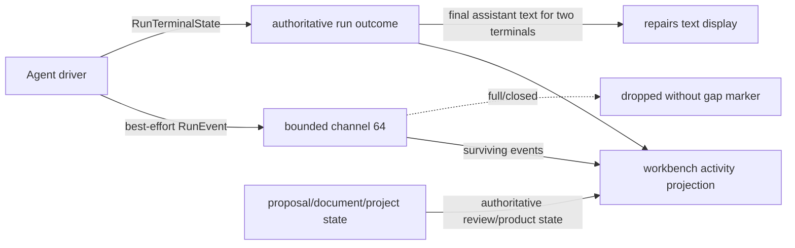

# Events, observability, and steering comparison

**Research date:** 2026-07-22 (Asia/Taipei)

**Status:** Reviewed

**Umbrella revision:** 1

**Current Rollshot revision:** `73de4fcc6a70dbb405be6712fdc7b91ce34b596f`

**Reference revisions:** Pi `dd6bea41efa8caa7a10fe5a6401676dc5699f83f`;
oh-my-pi `7b141199d524b859c357fc89654f10b62b9f3df1`; Codex
`4a443994bd12f49f2f08b21a2f224d9d42b9e734`; Claude Code source
`2ca5ddabfed5f220812ea11f029eda03b21bc4c1`.

**Evidence mode:** static source and test-source inspection. No provider,
desktop UI, reconnect, crash, task, steering race, or retention timer was
executed. The reference roots were absent from Rollshot's code-review graph,
so their pinned source trees were inspected with bounded searches after the
required graph-first checks.

This document compares implemented semantics, not similarly named types. It
does not select a final Rollshot foundation.

## 1. Problem statement and workload pressure

Rollshot currently has two different event-shaped product paths:

1. `rollshot-agent` emits a small, live `RunEvent` stream to the Smart
   Redaction workbench and separately returns a typed `RunTerminalState`.
   The terminal is authoritative; the event channel is a best-effort display
   projection. `AuditEvent` exists as a serializable type but is only exercised
   in tests. [E:R1-R4]
2. Action Guide uses operation/revision-correlated progress and publish events
   around durable project state. The project manifest and publish outcome are
   authoritative; transient progress is not a unified agent event stream.
   [E:R5-R8]

The workload ladder creates three different requirements:

| Workload | Current evidence | Event/steering pressure inferred from it |
|---|---|---|
| Smart Redaction | The app starts one bounded run, shows streamed assistant/tool/source activity, and lands in review, needs-input, cancelled, budget, validation, protocol, runtime, or provider terminal state. [E:R1-R4, W1] | A reconnectable full event log is not yet proven necessary. The UI does need an unambiguous terminal, privacy-safe progress, a truthful dropped-update story, and defined semantics for user input that arrives while a turn is active. |
| Action Guide | Project manifest revision and frame hashes are durable. Video import and publish operations carry operation IDs/revisions, reject late results, and expose transient progress. Annotation/caption proposals carry run/proposal/document or project revision provenance and review state. [E:R5-R8, W2] | UI reconstruction must come from the durable project/proposal/publish state, not from replaying every progress notification. Correlation and stale-result rejection are more important than retaining raw logs. |
| Deferred brag + Hyperframes | The deferred workload stages inspect, plan, checks, render, poster and share-copy around explicit approvals, expected artifacts, background work, selective retry and collaborative pauses. [W3-W6] | If adopted, it pressures durable task/job/artifact/review receipts, reattach/replay or explicit gaps, checkpoint pause/resume, and a distinction between “steer this active turn,” “queue next turn,” and “cancel work.” It still does not prove that every text/tool delta belongs in durable history. |

## 2. Vocabulary: three planes, not one event bus

The following planes are intentionally non-equivalent:

| Plane | Purpose | Acceptable loss | Authority and reconstruction rule |
|---|---|---|---|
| **Transient display projection** | Responsive text deltas, spinner/progress, safe tool labels, logs and hints. | Coalescing or loss can be acceptable if disclosed and if a terminal/snapshot repairs the visible state. | Never the sole authority for product state, review, artifact completion, budget enforcement or cancellation outcome. A gap must either be visible or be repaired from an authoritative query/snapshot. |
| **Durable audit evidence** | Privacy-safe proof that a material command or state transition was accepted and what identity/revision caused it. | Interior loss is not acceptable after acknowledgment; retention may deliberately expire records under a stated policy. | Append/receipt semantics. It may prove transitions without containing enough payload to rebuild the UI or resume a model turn. |
| **Reconstruction state** | The state from which a UI, workflow or resumable operation can be rebuilt: snapshot, transcript, project manifest, task/job record, artifact registry or reducible journal. | Loss follows the owning durability contract, not display-channel behavior. | The product must name one authoritative read. If a journal is the authority, ordering, schema migration, corruption and duplicate rules become correctness requirements. If a snapshot/artifact is the authority, events are projections/receipts. |

Related terms used below:

| Term | Meaning in this comparison |
|---|---|
| **Run / turn / message / tool event** | Lifecycle observations for one bounded agent execution, one model exchange, a streamed message, or a correlated tool call. A tool-call ID is not automatically an event ID or an execution-attempt ID. |
| **Task / job event** | Lifecycle of product work or detached/external execution. It must be qualified as live-process, durable-work-ledger, or product task state. |
| **Compact event** | Notification or durable boundary representing context compaction. A progress event does not prove the compacted transcript was committed. |
| **Artifact / review event** | A notification about a typed artifact identity/revision or review decision. A path, text delta, task notification, or tool result is not an artifact/review contract by itself. |
| **Terminal event/state** | The authoritative end of the scoped unit. “Stream ended,” “agent idle,” “tool ended,” and “artifact committed” are different boundaries. |
| **Steering** | User or host input deliberately applied to an already active agent loop at a documented boundary. It is not synonymous with queueing a future prompt, replying to a permission request, cancelling, or editing durable product state. |

### 2.1 Identity and ordering lens

This is a comparison lens, not a proposed mandatory envelope. For each system
the matrix asks whether the observable contract defines:

- `event_id`: identity of one event record;
- `stream_id` or aggregate identity: the ordered scope;
- `sequence`: monotonic position within that scope;
- `kind` plus schema revision;
- `occurred_at` versus `recorded_at` time;
- run, turn, message, tool-call, tool-attempt, task, job, artifact and review
  identities where applicable;
- `causation_id`: the command/event that directly caused the record;
- `correlation_id`: a broader operation spanning records;
- domain `revision`: optimistic-concurrency/staleness identity, distinct from
  stream sequence and event schema revision;
- privacy classification, redaction version and retention class.

A UUID without an ordering scope does not solve reconnect. A sequence without
an authoritative snapshot or retained replay window does not solve
reconstruction. A timestamp does not define causality. A domain revision does
not identify multiple notifications emitted for that revision.

## 3. Current Rollshot behavior

### 3.1 Agent run events: live projection and typed terminal

`RunEvent` currently contains five variants:

- `TextChunk { text }`;
- `ToolCallStart { name }`;
- `ToolCallEnd { name, success }`;
- `SourceChanged { tool, diff }`, where `SourceDiffSummary` includes old/new
  generation, before/after byte counts, omitted-line count and diff lines;
- `TurnComplete`.

The enum carries no event, run, turn, message, tool-call or attempt ID; no
sequence, timestamp, causation/correlation ID or schema revision. The driver
emits text chunks, tool starts/ends and source-change summaries. In the
investigated production driver, `TurnComplete` was not emitted; its only
construction was in a runtime test, while the workbench maps it to no activity
entry with a comment that the driver does not emit it. [E:R1-R3, A:R-EVENT,
A:R-IDENTITY]

`ChannelEventSink` uses a bounded Tokio channel of 64 and `try_send`; a full or
closed channel silently drops an event. The iced stream drains surviving
events and finally receives the authoritative `RunTerminalState`. Text chunks
are accumulated for display, but a `ReadyForReview` or `NeedsUserInput`
terminal supplies final assistant text, repairing text-delta loss. There is no
equivalent repair for omitted tool/source activity and no gap marker, cursor,
reconnect or replay store in the investigated workbench/agent roots.
[E:R2-R4, A:R-REPLAY]

This yields the current authority split:



`RunTerminalState` distinguishes `ReadyForReview`, `NeedsUserInput`,
`Cancelled`, a budget dimension, source-validation failure, runtime failure,
agent-protocol failure and provider failure. A terminal tool returns
`NeedsUserInput`; it ends the current run rather than pausing it for same-run
input. Cancellation is checked through the bounded run. A named steering or
follow-up API, active-turn input queue, pause/resume/checkpoint operation and
restart reconstruction were not found in the exact current roots
[A:R-STEER].

Tool display events are labels, not correlated executions. In the serial batch
path, tool-call IDs exist in model/tool protocol state, but `RunEvent` drops
them. On a terminal tool error the source can emit an immediate unsuccessful
end and later emit batch-level end cards; without call/attempt identity,
consumers cannot prove whether repeated name/status cards represent distinct
calls, attempts or projection bookkeeping. This source consequence was not
runtime-tested here. [E:R1, A:R-EVENT]

### 3.2 `AuditEvent`: serializable test surface, not current production audit

`AuditEvent` has `TurnStarted { session_id, generation }`,
`BudgetCharged { dimension }`, `CancellationRequested`, and
`RunCompleted { outcome }`. It is serde-tagged and round-trip tested. Exact
construction searches found the variants only in runtime tests, not in the
production driver/app path. It has no event ID, sequence, time, schema
revision, causation/correlation or append-store contract. It therefore must
not be described as Rollshot's current durable audit log. [E:R3,
A:R-EVENT, A:R-IDENTITY]

The type name `AgentEvent` was not found in the current investigated Rollshot
agent/workbench roots [A:R-EVENT]. The current outward live type is
`RunEvent`; references to a “Rollshot AgentEvent” would be a naming error.

### 3.3 Action Guide and product events: correlation without event sourcing

Action Guide provides useful, separate patterns:

- `EventAggregator` coalesces consecutive typing/scroll semantic actions
  inside a window and preserves the earliest timestamp; clicks, Enter and Tab
  break a run. `SemanticAction` deliberately cannot carry typed text, raw key
  codes or device identity, and serialization tests enforce those privacy
  exclusions. [E:R5]
- Annotation and caption proposals carry stable run/proposal or suggestion
  identity plus document/project revision evidence. Proposal state is
  `Pending`, `Accepted`, `Rejected` or `Stale`; lowering/review checks reject
  stale bases. [E:R6]
- `ProjectManifestV2` stores schema version, project revision, frame hashes and
  dimensions, ordered steps and product data. It is reconstruction authority,
  not a replay of UI notifications. [E:R6]
- Publish notifications are `CoreCommitted`, `OutputCommitted`,
  `OutputFailed`, and `Finished`; each is correlated with a
  `PublishOperationId` and revision. `PublishArbiter` rejects events from a
  superseded operation/revision, and `PublishStateV1` records successful
  revision/output freshness and reconciles file presence. [E:R7]
- Video import progress carries pass (`preflight`, `analyze`, `extract`),
  processed/total milliseconds and retained candidates. The coordinator uses
  operation identity to reject late progress. Like publish progress, delivery
  is best-effort through `try_send`; the terminal/outcome and durable domain
  state are authoritative. [E:R8]

These are not one unified agent journal. Their strongest reusable ideas are
privacy-shaped payloads, operation/revision correlation, stale-event rejection
and an authoritative product-state read after transient progress.

## 4. Per-system behavior

### 4.1 Pi: awaited lifecycle stream plus in-memory steering queues

Pi core emits `agent_start/end`, `turn_start/end`, `message_start/update/end`,
and `tool_execution_start/update/end`. Turn end includes the assistant message
and tool results; message update carries streaming deltas/snapshots; tool
events carry `toolCallId`, name, arguments, partial/final result and error
state. The event union does not define a global event ID, stream sequence,
timestamp, causation/correlation ID or schema revision [A:P-IDENTITY]. Tool
call ID correlates one tool lifecycle. The awaited emitter gives a live
delivery order; parallel tool ends may arrive in completion order while the
final correlated result batch preserves model-call order. [E:P1-P3]

The coding session adds `agent_settled`, queue updates, compaction start/end,
auto-retry and session-entry notifications. Durable JSONL entries reconstruct
conversation branches and compacted context, but the live event stream is not
persisted as an ordered audit journal. Steering/follow-up queues and in-flight
operations are process memory and are not reconstructed from session entries
[A:P-REPLAY].

Pi exposes two queues:

- **steering** is drained before the first sample if already queued, otherwise
  after a complete assistant response and its complete tool batch, before the
  next model request;
- **follow-up** is drained only when there are no tool calls/steering and the
  loop would otherwise stop.

Each queue supports one-at-a-time or drain-all behavior. Steering does not
interrupt an executing tool batch. There is no core active-run pause/checkpoint
or durable queue recovery in the investigated boundary [A:P-STEER].

### 4.2 oh-my-pi: richer live orchestration, still mixed durability

oh-my-pi retains the Pi run/turn/message/tool lifecycle and tool-call
correlation. Its session surface adds auto-compaction and auto-retry
start/end, fallback, notices, Todo reminders, Goal changes and session compact
hooks. The JSONL conversation is durable, but the broad live events are not a
single sequenced event store [E:O1-O3, A:O-REPLAY].

Its Agent supports two interrupt policies:

- **wait:** queued steering is applied after the current turn/tool batch;
- **immediate:** after the currently executing tool completes, remaining tool
  calls in that assistant batch are skipped and steering is applied at the
  next model boundary.

Follow-up retains Pi's “only when otherwise stopping” semantics. Non-
interrupting **asides** from background jobs/LSP are drained at step
boundaries. A pause gate/deadline exists, but the compared source does not turn
the process-local steering/asides/job state into restart-safe checkpoint state
[E:O2-O4, A:O-REPLAY].

Task events include raw child events and aggregated progress/lifecycle
(`started`, `completed`, `failed`, `aborted`) correlated with child identity,
parent tool-call ID, index and session file. Process-local Jobs track ID, type,
status, owner, start time, details and queued delivery, with bounded terminal
retention. Optional OpenTelemetry and run-summary/coverage provide additional
observability. These are useful live orchestration surfaces, not proof of
durable task/job reconstruction after process death [E:O4-O6,
A:O-REPLAY].

### 4.3 Codex: correlated protocol events and layer-scoped loss contracts

Codex core wraps each outward `EventMsg` in `Event { id, msg }`; the ID
correlates the event to a submission. The protocol includes warnings/errors,
turn start/complete/abort, token counts, agent/user/reasoning content,
item/tool lifecycle, approvals and user input, plans/goals, environment and
diff/agent notifications. Turn events have `turn_id`; start can include
`trace_id`, timestamp and context window, while completion/abort includes
timing/duration data. Item lifecycle carries thread/turn identity and
timestamp; tool items carry call IDs/status. There is no documented global
monotonic sequence in the core `Event` envelope [E:C1-C3,
A:C-IDENTITY].

Rollout persistence stores selected response items, event messages, turn
context, world state and compaction records for transcript reconstruction. It
does not promise that every outward event is a durable replayable journal.
[E:C4]

Codex's live/recovery behavior then separates into three transport layers that
must not be collapsed:

1. **Raw in-process app-server runtime:** a small delivery-required
   notification set awaits channel capacity. Other server notifications use
   `try_send`; on a full queue the runtime logs a warning and drops the
   notification. Although the shared event enum declares `Lagged`, the exact
   raw-runtime source constructs no lag marker for this overflow, so the raw
   consumer sees silent discontinuity. Server requests have a separate
   overload-rejection path. [E:C3, A:C-APP-REPLAY]
2. **`app-server-client` forwarding queue:** the facade drains the raw handle
   into another bounded consumer queue. When this downstream queue drops one
   of its own best-effort events, it increments `skipped_events` and later
   emits `Lagged { skipped }`; delivery-required transcript/terminal events
   wait for capacity. That marker counts only facade-layer drops. It cannot
   detect or retroactively report a notification already dropped by the raw
   runtime. Neither app-server layer supplies a general replay cursor.
   [E:C3, A:C-APP-REPLAY]
3. **Exec-server process recovery:** this independent, process-scoped contract
   reconnects with `resume_session_id`, requests retained output with
   `after_seq`, and validates recovered process-event sequences. Retention is
   bounded (30-second session/process windows and a 1 MiB/50,000-chunk output
   buffer in the inspected source); if required events are no longer retained,
   recovery records a protocol failure and attempts to terminate the process
   rather than inventing continuity. This stronger behavior does not apply to
   the general app-server notification stream. [E:C5, A:C-EXEC-REPLAY]

`Op::UserInput` first attempts to steer the active regular turn. Optional
`expected_turn_id` prevents misapplication and `client_user_message_id`
supports client correlation. Review/compact turns are not steerable. If no
active turn exists, input starts a new regular task. Active-turn input enters
an input queue and is drained before a later model request, except at initial
turn start and immediately after auto-compaction, where the regular or
continuation sample deliberately goes first. `Interrupt` cancels the active
task and yields a typed `TurnAborted` reason; it is not queued steering.
[E:C6-C7]

Standalone product Task/Workflow/Job/Artifact lifecycle entities were not
found in the reviewed Codex domain boundary [A:C-DOMAIN]. Protocol “task
started/complete” aliases are compatibility names for turn lifecycle, not
evidence of a product task model.

### 4.4 Claude Code: queued prompts, interrupt control, task SDK projection

Claude's QueryEngine yields user, assistant, stream, system and result
messages with session/message identity, and persists selected conversation and
compact-boundary data to JSONL. Its noninteractive SDK adds a separate global
queue for:

- `task_started` with task/tool-use identity and description/type;
- `task_progress` with usage, last tool, summary and workflow deltas;
- terminal `task_notification` with status, output path, summary and usage;
- `session_state_changed` with `idle`, `running` or `requires_action`.

The queue is capped at 1,000 and drops the oldest event. A random UUID and
session ID are attached when events are drained, so that UUID identifies the
delivered record rather than a pre-enqueue domain transition. The SDK task
event shapes have no sequence, gap marker, causation ID, schema revision or
replay cursor [E:L1-L3, A:L-SDK-IDENTITY]. `idle` is intentionally emitted
after held-back background results flush and is the authoritative live “turn
over” signal for SDK consumers; it is not a durable task snapshot.

Runtime Tasks have prefixed random IDs and pending/running/completed/failed/
killed state, start/end times, output file/offset and notification state.
Implementations cover local shell/agent, remote agent and in-process teammate;
the reviewed profile's exact implementation audit did not find the named
`local_workflow` or `monitor_mcp` implementations [A:L-TASK-IMPL]. Task
output files, transcript state and remote sidecars are heterogeneous recovery
surfaces, not one durable lifecycle journal. Generic runtime-task resurrection
was not found in the investigated roots [A:L-TASK-RECOVERY].

Structured noninteractive input places user messages into a FIFO command
queue. While one `run()` is active, later prompts wait; consecutive prompt
commands are greedily batched into one subsequent `ask()` call. They do not
implicitly interrupt the active query. A separate SDK `interrupt` control
request aborts the current turn; the query path closes outstanding tool-use
protocol with synthetic/aborted results. Duplicate user UUIDs are checked
against transcript and process memory before enqueue. A distinct named
current-turn steer queue/policy was not found in the bounded input/query roots
[A:L-STEER]; therefore the exact semantics should be described as **queued
next prompt(s) plus separate interrupt**, not Pi-style steering. The source has
an opt-in interrupted-turn auto-resume path that re-enqueues a reconstructed
prompt, but this does not resurrect generic Runtime Tasks or the lossy SDK
task-event queue. [E:L4-L6]

## 5. Lifecycle coverage matrix

“Yes” means the scoped system exposes a positive lifecycle contract; it does
not mean the event is durable. Every absence/unknown is scoped to an exact
audit below.

| Unit | Rollshot | Pi | oh-my-pi | Codex | Claude Code |
|---|---|---|---|---|---|
| Run/agent | Typed terminal plus `RunEvent`; no production run-start/end event pair in investigated sink [A:R-EVENT]. | `agent_start/end`, plus coding `agent_settled`. | Pi pair plus telemetry/coverage/session notices. | Thread/turn/task protocol is primary; a separate generic Product AgentRun event pair was not found [A:C-DOMAIN]. | Query system/result plus session running/idle; a unified durable run event pair was not found [A:L-SDK-IDENTITY, A:L-TASK-RECOVERY]. |
| Turn | `TurnComplete` variant exists but production emission was not found [A:R-EVENT]. | `turn_start/end` with message/tool results. | Same, with compaction/retry additions. | `TurnStarted/Complete/Aborted` with identity and timing. | Query/message loop has turns/results; a dedicated durable turn journal was not found in the SDK task-event/recovery roots [A:L-SDK-IDENTITY, A:L-TASK-RECOVERY]. |
| Message | `TextChunk` only; no message ID/start/end [A:R-IDENTITY]. | start/update/end. | start/update/end. | agent/user/reasoning and item lifecycle with turn/thread context. | user/assistant/stream/result messages with UUID/session context. |
| Tool | start/end by safe-ish name only; no call/attempt ID [A:R-IDENTITY]. | start/update/end by tool-call ID. | Same plus child/asides integration. | item lifecycle and tool call IDs/status. | assistant tool-use/tool-result stream; task SDK carries optional parent tool-use ID. |
| Product Task | No declaration/event in current agent roots [A:R-TASK]. | Not found in built-in roots [A:P-TASK]. | Child Task lifecycle exists, but is agent delegation rather than a general product task. | Not found in reviewed domain roots [A:C-DOMAIN]. | Durable work-ledger and live Runtime Task exist, but they are separate machines. |
| Compact | No agent compact lifecycle [A:R-COMPACT]. | coding compaction start/end and durable entries. | auto-compaction/session before/after hooks. | context-compacted/compaction rollout records. | compact-boundary/system messages and transcript reconstruction. |
| Job | No agent Job lifecycle [A:R-TASK]. Action Guide import/publish operations are product-specific. | No built-in Job lifecycle [A:P-TASK]. | Process-local Job registered/progress/terminal/delivery. | No generic Job entity [A:C-DOMAIN]; exec process events are a specialized protocol. | Runtime task categories/output sidecars approximate jobs; no common durable Job entity was found [A:L-TASK-RECOVERY]. |
| Artifact | Proposal/source diff and Action Guide project/publish identities exist, but no unified agent artifact event contract [A:R-TASK]. | No typed product artifact lifecycle in core [A:P-TASK]. | Child result/session files exist; no unified typed artifact lifecycle [A:O-ARTIFACT]. | No standalone product Artifact lifecycle in reviewed domain roots [A:C-DOMAIN]. | Task output paths/transcripts/sidecars are heterogeneous; no common typed artifact lifecycle [A:L-ARTIFACT]. |
| Review | `ReadyForReview` terminal and proposal accept/reject/stale state; no durable unified review event [A:R-TASK]. | No built-in product review lifecycle [A:P-TASK]. | Permission/UI hooks exist; a typed product review receipt was not found [A:O-ARTIFACT]. | Approval/user-input protocol exists; no generic product review artifact lifecycle [A:C-DOMAIN]. | Permission/control requests and work-ledger changes exist; no common artifact-review receipt [A:L-ARTIFACT]. |
| Terminal | `RunTerminalState` is authoritative; Action Guide has publish/import/proposal terminal state. | `agent_end` after subscribers settle. | agent/task/job terminal paths; durability differs. | typed complete/abort/error and process terminal; scope-specific. | result + authoritative live idle; task notifications may be lossy [A:L-SDK-IDENTITY], so runtime/task state or output remains necessary. |

## 6. Identity, order, replay, and UI reconstruction

| Property | Rollshot | Pi | oh-my-pi | Codex | Claude Code |
|---|---|---|---|---|---|
| Event identity | None on `RunEvent`/`AuditEvent` [A:R-IDENTITY]. Product operation/proposal IDs are domain identities, not universal event IDs. | No global event ID [A:P-IDENTITY]; tool-call IDs correlate tools. | Same core boundary; child/job IDs correlate their lifecycles, not every event [A:O-IDENTITY]. | `Event.id` correlates submission; turn/item/tool identifiers add scope. | Stream messages and drained SDK events use UUID/session IDs; task SDK UUID is assigned at drain. |
| Sequence/order contract | Channel arrival/UI vector order only; activity `sequence` is display index, not producer sequence [A:R-IDENTITY]. | Awaited emitter order; no explicit monotonic sequence [A:P-IDENTITY]. | Live emitter/manager order; no unified monotonic sequence [A:O-IDENTITY]. | No global core sequence [A:C-IDENTITY]; exec output has a specialized chunk sequence. | FIFO queue order for surviving SDK events; no explicit sequence [A:L-SDK-IDENTITY]. |
| Causality/correlation | Tool/source labels and generations; no causation/correlation envelope [A:R-IDENTITY]. | Tool-call IDs; broader causality implicit in loop order [A:P-IDENTITY]. | Tool/parent-child/job/session IDs; broader causality implicit. | submission event ID, trace/turn/thread/item/tool IDs and client message ID provide layered correlation. | session/message/task/tool-use IDs; no common causation link [A:L-SDK-IDENTITY]. |
| Schema/domain revision | Serde type shape has no event schema revision; Action Guide manifest schema/project revisions are positive domain evidence. | Session entry variants/versioning, but no event-envelope revision [A:P-IDENTITY]. | Session formats/extensions, but no unified event-envelope revision [A:O-IDENTITY]. | Versioned protocol/app-server surfaces; core event envelope has no per-record schema revision [A:C-IDENTITY]. | SDK schemas and transcript records, but task SDK record has no schema revision [A:L-SDK-IDENTITY]. |
| Drop/gap behavior | `try_send` silently drops; no gap marker [A:R-REPLAY]. | Subscriber behavior is awaited in core; no reconnect-gap contract [A:P-REPLAY]. | Task/job delivery has local retry/retention; no restart cursor/gap contract [A:O-REPLAY]. | Raw app-server best-effort overflow warns and drops without a gap marker; `app-server-client` reports only drops in its own forwarding queue; exec process recovery rejects missing retained sequences [A:C-APP-REPLAY, A:C-EXEC-REPLAY]. | SDK queue drops oldest silently at cap [A:L-SDK-IDENTITY]. |
| Deduplication | No event dedup key [A:R-REPLAY]; domain operation/revision stale checks exist. | Tool-call correlation, but no generic replay dedup contract [A:P-REPLAY]. | Manager IDs/local state; no restart event dedup contract [A:O-REPLAY]. | Client message IDs/turn expectation and exec `after_seq` support scoped dedup/replay. | User UUID dedup checks transcript + memory; task SDK notifications have no stable pre-enqueue event key [A:L-SDK-IDENTITY]. |
| Reconnect/replay | No agent event replay/cursor [A:R-REPLAY]. Reload Action Guide from manifest/publish state instead. | Rebuild conversation from JSONL, not live event stream; steering queues not restored [A:P-REPLAY]. | Rebuild conversation/child artifacts selectively; process-local jobs/events not generically restored [A:O-REPLAY]. | Rollout reconstructs selected conversation state. Raw app-server has neither replay nor an overflow marker; the facade's local `Lagged` marker has no replay; only exec process output has bounded `after_seq` recovery with gap rejection [A:C-APP-REPLAY, A:C-EXEC-REPLAY]. | Resume conversation/interrupted prompt selectively; no SDK task-event replay cursor and no generic task resurrection [A:L-TASK-RECOVERY]. |
| UI reconstruction authority | Typed run terminal plus proposal/document/project/publish state; activity feed is advisory. | Session tree/transcript plus current Agent/session state; events drive live UI. | Session state plus Todo/Goal/task/job managers; persisted and live portions differ. | Thread/rollout/state DB plus current protocol snapshots; live notifications are projections. | Transcript/work ledger/runtime task/output sidecars; `session_state_changed` is only a live turn boundary. |

### 6.1 UI reconstruction rule for Rollshot comparisons

A future UI must be able to answer these questions without assuming lossless
display delivery:

1. **What is true now?** Query the authoritative run/task/job/proposal/
   artifact/review state and revision.
2. **What changed while disconnected?** Replay retained sequenced records or
   return an explicit gap and a fresh snapshot. Never silently splice a live
   suffix onto an unknown prefix.
3. **Which updates are merely decorative?** Text deltas, spinner ticks and
   fine-grained logs can be coalesced/dropped if the terminal/snapshot repairs
   them.
4. **Can this command be retried?** Use a client command/idempotency key and
   return the already-created transition/receipt. Do not infer acceptance from
   seeing a progress event.
5. **Does this result still apply?** Compare domain revision/base state and
   operation identity, as Action Guide already does.

## 7. Steering and control matrix

| Control | Rollshot | Pi | oh-my-pi | Codex | Claude Code |
|---|---|---|---|---|---|
| Follow-up | No named same-session follow-up queue found [A:R-STEER]. A new run must be host-driven after terminal. | Dedicated queue; only drained when no tools/steering and loop would stop. | Same semantic, with additional asides/task signals. | Ordinary user input starts a new regular turn when none is active; no separately named “only-if-stopping” follow-up queue in reviewed source [A:C-STEER]. | Later prompts wait in FIFO and may batch into the next `ask`; no separate named follow-up policy [A:L-STEER]. |
| Steer active work | Not found [A:R-STEER]. | Applied before first sample if prequeued, else after current assistant + complete tool batch. | `wait` matches Pi; `immediate` waits for current tool then skips remaining tool calls before next sample. | Active regular turn accepts queued input, optionally guarded by expected turn ID; sampled at documented later boundaries. | Distinct active-turn steer API/policy not found [A:L-STEER]; queued prompt does not implicitly interrupt. |
| Queue identity/dedup | Not found [A:R-STEER]. | One/all in-memory queues; no durable command ID [A:P-REPLAY]. | One/all queues/asides in memory; no durable replay key [A:O-REPLAY]. | client user-message ID and expected turn ID. | User UUID dedup against transcript + memory; batched prompt acknowledgments preserve individual UUIDs. |
| Interrupt | Cancellation exists, but no separate active-turn “interrupt and keep session queued input” contract [A:R-STEER]. | Steering does not interrupt current tool batch; cancellation is separate. | Immediate steering skips only not-yet-started tools after current tool; cancellation remains separate. | Interrupt cancels active task and emits typed turn-aborted reason. | SDK interrupt aborts active query/tools; queued prompts are separate. |
| Cancel | Cancellation token maps to typed `Cancelled`. | Abort/cancel ends run; queue durability not provided. | Abort controllers for agent/task/job; exact terminal depends on unit. | Active task cancellation and typed abort reason. | Abort controller closes current query; Runtime Tasks also have kill/stop paths. |
| Checkpoint/pause/resume | No run pause/checkpoint/resume [A:R-STEER]; `NeedsUserInput` ends run. | No core active-run pause/checkpoint/resume found [A:P-STEER]. | Pause gate exists; restart-safe paused run was not found [A:O-REPLAY]. | Compact/review tasks and rollout resume exist, but active regular steering is deliberately unavailable for review/compact; this is not a generic paused-run checkpoint. | Interrupted prompt can optionally auto-resume; generic active-query checkpoint and Runtime Task resurrection were not found [A:L-TASK-RECOVERY]. |
| Needs input / permission | Typed terminal text; host must start later work. | Usually tool/extension/user loop; no Rollshot-like terminal contract [A:P-STEER]. | Permission/tool UI, pause and asides have unit-specific control paths [E:O2-O5]. | Typed user-input/approval protocol can block/resume the owning task. | `requires_action`, control/permission responses and SDK interaction; live state is distinct from durable task state. |
| Current-vs-next timing authority | Host sees only terminal/current cancellation; no active queue [A:R-STEER]. | Agent loop queue-drain points. | Agent interrupt mode + step boundaries. | Active regular turn type, queue-drain logic, expected turn ID. | `running` guard + FIFO command queue; interrupt control is explicit. |

The product-facing distinction should remain explicit: **steer** changes the
next model input of an active loop; **follow-up** starts/extends work only when
the loop would stop; **interrupt** preempts the active unit under defined
cleanup; **cancel** requests a terminal outcome; **needs input** either pauses
a resumable unit or ends it with continuation data. These commands must not be
collapsed into one “send message” button without displaying when the input
will take effect.

## 8. Observability, cost, privacy, redaction, and retention

| Concern | Comparative finding | Rollshot implication, not selection |
|---|---|---|
| Progress | Fine-grained model/tool/task progress is broadly live and can be lossy; domain state/terminal must repair it. Codex demonstrates that loss claims are layer-scoped: its client facade marks its own forwarding drops, its raw app-server can silently drop best-effort notifications, and its exec recovery separately rejects process-event gaps. Action Guide already rejects stale operation updates. | A progress card should say “updates skipped” only for loss the reporting layer can observe, or refresh an authoritative snapshot. Never infer end-to-end continuity from a downstream lag marker or success from 100% progress without terminal/artifact validation. |
| Logs | Tool arguments/results, source diffs, prompts and assistant text can contain pixels-derived text, filenames, secrets or user content. Pi/OMP/Claude can expose rich tool/message payloads; Rollshot's current `TextChunk` and diff lines are also sensitive. | Default durable audit should store allowlisted metadata/digests, not raw prompts, model text, tool args/results, OCR text, source diff lines or image bytes. Rich logs require a separate access/retention policy. |
| Cost/usage | Codex/Claude/OMP expose token/cost/usage telemetry in several events. Pi provides usage through messages/session surfaces. Rollshot budgets include cost, but the reviewed production provider accounting leaves cost at zero; therefore current cost progress is not an enforceable or truthful provider-cost meter. [E:R9] | Distinguish observed usage, estimated cost, reserved budget and enforceable charged budget. Include source/currency/model and “unknown” rather than zero when unavailable. |
| Cancellation | An accepted cancel command and an observed cancelled terminal are separate facts; external effects can remain unknown. | Audit command acceptance, requested target/revision and final reconciled terminal separately. A dropped progress event must not erase cancellation truth. |
| Privacy/redaction | Action Guide semantic input proves a useful minimum-data pattern. External rich event streams demonstrate how easily observable payloads become transcripts/log stores. | Redaction occurs before enqueue/persist/export. Persist redaction-policy version and payload class; reject unknown fields for durable event schemas. |
| Retention | OMP process-local Jobs have bounded terminal retention; Codex exec replay has bounded TTL/buffer; Rollshot/Claude live queues are bounded by capacity rather than durable policy. | State retention, audit retention, replay retention and raw diagnostic retention need separate durations and deletion semantics. Expired replay must return an explicit gap/expired result. |
| Export/telemetry | OMP OpenTelemetry/coverage and Codex/Claude protocol streams can feed external observers; that does not make them product authority. | Export only the privacy-safe projection. Backpressure/export failure must not block or mutate the authoritative state transition unless explicitly designed as an audit-commit requirement. |

## 9. Candidate Rollshot patterns without final selection

### Pattern A — authoritative snapshot plus lossy privacy-safe projection

Keep the authoritative state in the existing typed run terminal and
product-owned proposal/document/project/publish records. Emit a bounded
`RunProgressV1` projection such as:

```text
{ run_id, emission_no, kind: ToolStarted { call_id, safe_tool_key } }
{ run_id, emission_no, kind: ToolFinished { call_id, attempt_no, outcome_class } }
{ run_id, emission_no, kind: ProgressGap { first_missing, next_observed } }
{ run_id, emission_no, kind: TerminalObserved { terminal_class, state_revision } }
```

`emission_no` is scoped to the live run and may be retained only long enough
to detect channel loss. Payloads exclude prompts, assistant text, raw tool
arguments/results, OCR, filenames, pixels and diff lines by default. On
reconnect/gap the UI queries the terminal/proposal/product snapshot rather
than demanding full event replay. A downstream `ProgressGap` may report only
the sequence or drops visible at that layer; it must not imply that an
unsequenced upstream producer was lossless.

**Fit/trade-off:** minimal for Smart Redaction and close to existing Action
Guide operation/revision patterns. It improves correlation and honest gaps
without committing to an event store. It cannot by itself provide a durable
history of accepted steering/review/cancellation commands or reconstruct a
deferred multi-stage workflow.

### Pattern B — privacy-safe sequenced audit journal plus snapshots

Assign a durable aggregate (`task_id`, `workflow_id`, `job_id`, or proposal
identity) and append small receipts under one atomic monotonic sequence:

```text
AuditReceiptV1 {
  event_id, aggregate_id, sequence, schema_revision,
  causation_id, correlation_id, recorded_at,
  redaction_policy_revision, retention_class,
  kind:
    CommandAccepted { command_id, command_kind, expected_revision }
  | TerminalRecorded { terminal_class, resulting_revision }
  | ProposalReady { proposal_id, base_state_id, evidence_digest }
  | ReviewDecided { proposal_id, decision, reviewer_class }
  | ArtifactCommitted { artifact_id, revision, content_digest, validation_class }
}
```

Snapshots/artifact records remain the payload and reconstruction authority;
the journal proves transitions and supports `after_sequence` audit/reconnect.
Duplicate `command_id` returns the original receipt. An interior checksum or
sequence gap is corruption; an intentionally expired replay window returns a
typed gap plus snapshot revision. Incomplete tails may be tolerated only under
an explicit append format.

**Fit/trade-off:** stronger for approvals, deferred work and regulated support
questions. It adds atomic append allocation, migration, checksum/corruption,
retention deletion, idempotency and snapshot/journal reconciliation. It should
not be used to persist raw text/tool/source deltas merely because a journal
exists.

### Pattern C — dual live stream plus durable transition receipts

Use Pattern A for high-volume live display and persist only a narrow set of
Pattern B receipts: command accepted, pause/needs-input, cancel requested,
terminal, proposal ready, review decision, artifact commit and Job reattach
handle. Link the two with run/operation/call identities; the detailed stream
may expire quickly while receipts follow product retention.

**Fit/trade-off:** bounds durable privacy/cost while supporting deferred
approvals and recovery. It creates two schemas and requires the UI to avoid
treating rich live detail as authority. Whether the extra split is justified
depends on workload adoption and operational/audit needs. If delivery crosses
multiple bounded queues, each receipt/gap claim needs an end-to-end sequence
or an explicitly named hop; a downstream skip counter cannot repair upstream
silent loss.

### 9.1 Concrete privacy-safe Rollshot event patterns

At least these two patterns are compatible with current product evidence:

1. **Safe tool lifecycle:** persist/display only a stable allowlisted tool key,
   generated call ID, attempt number, timing bucket and outcome class. Do not
   store tool arguments, results, file paths, OCR text, assistant text or raw
   source diff. If support needs a payload, record a keyed digest and retrieve
   the separately protected artifact under explicit authorization.
2. **Proposal/review receipt:** record proposal ID, agent run ID, base document
   or project revision, evidence digest, policy version, decision and resulting
   revision. Do not duplicate image bytes, detected text, masks/regions or
   annotations into the audit record. The proposal/document remains the
   authorized payload and stale-base authority.
3. **Publish/import progress projection:** retain operation ID, expected
   revision, named pass, bounded numeric counters and terminal category; omit
   source media paths/content. On channel loss, reload `PublishStateV1` or the
   import outcome and show a gap rather than synthesizing missed progress.

## 10. Non-goals

- No final foundation or candidate is selected.
- Do not make every UI notification durable or event-source the existing
  Action Guide project merely for uniformity.
- Do not store raw prompts, assistant text, tool arguments/results, OCR text,
  pixels, paths or source diffs in a default audit stream.
- Do not claim that an event UUID supplies sequence, causality, idempotency,
  replay or authority.
- Do not equate a transcript, rollout, task output file, progress queue or
  OpenTelemetry export with a durable product-state journal.
- Do not infer tool success, task completion, artifact validity, review
  acceptance or cancellation completion from progress/log events.
- Do not silently convert user input into active-turn steering when the UI
  cannot state whether it will affect the current tool batch, next model
  sample, next turn or a new run.
- Do not expose Action Guide semantic input more broadly; its exclusion of raw
  typed text/key/device identity remains a privacy boundary.

## 11. Measurable evaluation criteria

Any later Rollshot design should be testable against these criteria:

1. **Authority:** after dropping every transient event, the same terminal,
   proposal/review, artifact and current task/job state is obtained from the
   authoritative read.
2. **Gap honesty:** force channel overflow and reconnect beyond retention. The
   client receives `Gap`/`Expired` plus a snapshot revision, never a silently
   continuous feed.
3. **Ordering:** concurrently append at least 10,000 receipts to one aggregate;
   committed sequences are unique and contiguous, or the store returns an
   explicit rejected/conflict result. Cross-aggregate total order is not
   required unless specified.
4. **Idempotency:** replay a command ID before response, after response and
   after restart. Exactly one domain transition occurs and each duplicate
   returns the same resulting identity/revision.
5. **Correlation:** two same-name tool calls and a retry remain distinguishable
   by call ID and attempt. A UI never pairs an end with the wrong start.
6. **Steering timing:** inject input before sampling, during streaming, during
   one of several tool calls, immediately after compaction and while awaiting
   review. The observed application boundary matches the documented policy,
   and expected-turn mismatch is rejected rather than redirected.
7. **Cancellation:** distinguish `cancel_requested`, `cancelled`,
   `completed_before_cancel`, and `effect_unknown/reconciliation_required`.
   A dropped display event cannot change the final category.
8. **Reconstruction equivalence:** rebuild a UI from snapshot plus replay and
   compare it to an uninterrupted UI for terminal/product state. Decorative
   text/log differences are allowed only where marked non-authoritative.
9. **Corruption/revision:** reject an interior journal gap/checksum failure,
   tolerate only a documented incomplete tail, migrate known schema revisions,
   and reject unknown durable event kinds rather than discard them silently.
10. **Privacy:** serialize every durable event through adversarial prompts,
    paths, OCR, filenames, tool arguments/results and image metadata; zero raw
    secret/content markers appear. Unknown payload fields fail closed. Record
    the redaction-policy revision.
11. **Retention:** automated clocks prove raw diagnostic, transient replay,
    audit receipt and product state expire independently; an expired replay is
    observable and deletion removes secondary indexes/exports within the
    stated SLA.
12. **Cost truthfulness:** unavailable provider usage is `unknown`, never
    charged zero; observed, estimated, reserved and enforced values remain
    separately labeled and reconcile within a declared tolerance.
13. **Backpressure:** slow UI and telemetry consumers do not stall authoritative
    transitions unless the audit receipt is explicitly part of the commit.
    Peak memory and event-to-terminal latency stay within declared budgets.

## 12. Evidence gaps and required spikes

1. Runtime-force Rollshot's 64-entry channel overflow and the tool-error path
   to confirm which cards repeat/drop and whether final text always repairs the
   visible response.
2. Exercise Pi/oh-my-pi steering while a parallel/serial tool batch is active,
   including cancellation and compaction boundaries; static control flow is
   strong evidence but not a race/latency measurement.
3. Exercise Codex's three loss layers independently: overflow the raw
   app-server best-effort queue, overflow the `app-server-client` forwarding
   queue, and reconnect exec-server with `after_seq` inside/outside retention.
   Confirm raw silent loss, facade-local `Lagged { skipped }`, and exec recovery
   failure/termination without treating one layer's result as another's.
4. Exercise Claude's 1,000-event SDK overflow, prompt batching, UUID duplicate
   handling and interrupted-turn auto-resume. Verify whether build/server gates
   change the compared behaviors.
5. Define Rollshot support/privacy/retention needs before deciding whether
   transition receipts must survive application/project deletion and whether
   user-visible text logs are ever exportable.
6. If the deferred workload is adopted, spike one pause → restart → resume →
   artifact review chain with an external Job. Measure whether snapshot plus
   narrow receipts suffices before considering a full event-sourced workflow.

### 12.1 Bounded absence and semantic audits

- **[A:R-EVENT] Rollshot event production audit.** Roots:
  `crates/rollshot-agent/src/{runtime,driver}.rs` and
  `crates/rollshot-app/src/result_workspace/workbench`. Exact groups:
  `\b(AgentEvent|RunEvent|AuditEvent|TurnComplete)\b`,
  `RunEvent::[A-Za-z_]+`, and `AuditEvent::[A-Za-z_]+`. Direct enum and caller
  inspection found no `AgentEvent`; production construction of text/tool/
  source `RunEvent`s; `TurnComplete` construction only in a runtime test; and
  `AuditEvent` variant construction only in runtime serialization/round-trip
  tests. Therefore a production AgentEvent, production TurnComplete emission,
  and production AuditEvent stream were **not found in the investigated
  scope**.
- **[A:R-IDENTITY] Rollshot event identity audit.** Same roots, with exact
  field groups `event[_ ]?id|sequence|causation|correlation|occurred[_ ]?at|recorded[_ ]?at|timestamp|schema[_ ]?revision|run[_ ]?id|turn[_ ]?id|message[_ ]?id|tool[_ ]?call[_ ]?id`. Direct inspection of the complete `RunEvent`,
  `SourceDiffSummary` and `AuditEvent` definitions found none of these event-
  envelope fields. `session_id` and `generation` in `AuditEvent::TurnStarted`,
  and source old/new generation, are positive domain fields, not an event ID
  or sequence. Workbench activity `sequence` is assigned from display-vector
  position. Thus event identity/order/causality/schema contracts were **not
  found in the investigated outward types**.
- **[A:R-REPLAY] Rollshot reconnect audit.** Roots:
  `crates/rollshot-agent/src` and Smart Redaction workbench run/state/update
  modules. Exact group:
  `replay|reconnect|after[_ ]?seq|cursor|event[_ -]?store|audit[_ -]?store|dedup|gap|lagged|resume`. Relevant matches were conversation/model concepts and
  UI comments; direct sink inspection found `try_send` and no retained event
  store/cursor/gap/dedup API. Therefore agent-event reconnect/replay and an
  explicit drop marker were **not found in the investigated scope**.
- **[A:R-STEER] Rollshot steering audit.** Roots:
  `crates/rollshot-agent/src/{domain,driver,runtime,tools}.rs` and Smart
  Redaction workbench run/state/update modules. Exact group:
  `steer|follow.?up|interrupt|pending[_ -]?input|queued[_ -]?input|pause|resume|checkpoint|needs[_ -]?input|request_user_input|cancel`. Positive results were cancellation and terminal needs-input. Queue matches belonged to transport/tool execution, not an active-turn user-input queue. A named steering/follow-up API, current-turn input queue, pause/checkpoint and resumable needs-input state were **not found in the investigated scope**.
- **[A:R-TASK] Rollshot unified lifecycle audit.** Roots:
  `crates/rollshot-agent/src`, `crates/rollshot-action/src`, and app Action
  Guide/Smart Redaction coordinators. Exact declaration/event group:
  `^(pub\s+)?(struct|enum|trait|type)\s+(Task|Workflow|Job|Artifact|Review)(Event|State|Record)?\b|Agent(Event|Task)|Artifact(Event|Lifecycle)|Review(Event|Receipt)|Job(Event|Record)`. Positive results were product-specific proposals, publish/import
  operations and review state. A unified agent Product Task/Workflow/Job/
  Artifact/Review event contract was **not found in the investigated scope**.
- **[A:R-COMPACT] Rollshot agent compaction audit.** Roots:
  `crates/rollshot-agent/src` and workbench run/state/update modules. Exact
  group `compact|compaction|context[_ -]?(summary|window)|checkpoint` returned
  no agent compact lifecycle type or production event. Therefore an agent
  compact lifecycle was **not found in the investigated scope**.
- **[A:P-IDENTITY] Pi event envelope audit.** Roots:
  `learn-projects/pi/packages/agent/src/{types,agent-loop,agent}.ts` and
  coding-agent core session event/types. Direct inspection of the complete
  `AgentEvent`/session-event unions plus exact group
  `eventId|event_id|sequence|seq\b|causation|correlation|occurredAt|recordedAt|timestamp|schemaVersion` found tool-call/message/session identities and session-entry timestamps outside the core event envelope, but no global event ID, monotonic stream sequence, causation/correlation field or per-event schema revision. Those envelope contracts were **not found in the investigated event union**.
- **[A:P-REPLAY] Pi live-state audit.** Roots: Pi agent loop/state and
  coding-agent `agent-session.ts`, session manager/store and session format
  documentation. Exact group:
  `steering|followUp|follow_up|queue|serialize|persist|resume|restore|replay|cursor|sequence`. Source inspection found in-memory steering/follow-up arrays and durable JSONL conversation/compaction entries, but no serialization/reconstruction of those queues, in-flight operations or the live AgentEvent stream. Durable live-queue/event replay was **not found in the investigated scope**.
- **[A:P-STEER] Pi control audit.** Roots: agent loop/agent types and coding
  AgentSession. Exact group `steer|steering|follow.?up|interrupt|pause|resume|checkpoint|abort`. Positive queue-drain behavior is described in §4.1. A core active-run pause/checkpoint/resume contract distinct from abort and session reconstruction was **not found in the investigated scope**.
- **[A:P-TASK] Pi product-lifecycle audit.** Roots:
  `learn-projects/pi/packages/{agent,coding-agent}/src`, excluding examples
  and vendored renderer assets. Exact declarations/fields:
  `^(export\s+)?(type|interface|class|enum)\s+(Task|Workflow|Job|Artifact|Review)\b|taskId|workflowId|jobId|artifactId|reviewId`. Provider/session/tool-call uses and documentation prose were excluded by direct inspection. Built-in Product Task, Workflow, Job, typed Artifact and product Review lifecycle contracts were **not found in the investigated scope**.
- **[A:O-IDENTITY] oh-my-pi event identity audit.** Roots:
  `packages/agent/src`, coding-agent session event/types, `src/task`, and
  `src/async` under `learn-projects/oh-my-pi`. The [A:P-IDENTITY] field group
  was rerun. Tool/child/job/session IDs and timestamps are positive local
  fields; a unified global event ID/sequence/causation/schema envelope was
  **not found in the investigated scope**.
- **[A:O-REPLAY] oh-my-pi live orchestration audit.** Roots: coding-agent
  AgentSession/session store, `src/task`, `src/async`, and agent queues. Exact
  group `serialize|deserialize|persist|restore|resume|rehydrate|reattach|replay|after.?seq|cursor|gap|steering|aside|pause`. Positive results were JSONL conversation, child-session/artifact revival, live steering/asides/pause and process-local Job delivery/retention. Serialization/restart restoration of the steering/asides queues, unified event stream or `AsyncJob` manager state was **not found in the investigated scope**.
- **[A:O-ARTIFACT] oh-my-pi unified artifact/review audit.** Roots:
  `packages/coding-agent/src/{task,async,goals}` and tool/session types. Exact
  group `Artifact(Event|Lifecycle|Record)|Review(Event|Receipt|Decision)|expectedArtifact|artifactRevision|reviewRevision`. Child results/session files and UI permission/review prose were positive adjacent concepts. A unified typed product Artifact lifecycle and durable product Review receipt were **not found in the investigated scope**.
- **[A:C-IDENTITY] Codex core event identity audit.** Roots:
  `learn-projects/codex/codex-rs/{protocol,core,app-server}/src`. Direct
  inspection covered `Event`, `EventMsg`, turn/item/tool event definitions and
  converters. Exact group:
  `event_id|sequence|causation|correlation|schema_revision|occurred_at|recorded_at|trace_id|turn_id|thread_id|call_id`. Positive identities/times are described in §4.3; no global monotonic sequence or per-record schema revision was **found in the core outward Event envelope**. Specialized exec-server chunk sequencing is explicitly excluded from that absence.
- **[A:C-APP-REPLAY] Codex app transport audit.** Exact roots:
  `learn-projects/codex/codex-rs/app-server/src/in_process.rs` and
  `learn-projects/codex/codex-rs/app-server-client/src/lib.rs`, including the
  latter file's inline tests. Exact groups:
  `InProcessServerEvent::Lagged|Lagged \{|skipped_events|try_send|send\(|queue is full|dropping in-process|forward_in_process_event|next_event_surfaces_lagged_markers`.
  The raw runtime hit its delivery classifier and awaited-send branch, plus a
  best-effort `try_send` branch whose full case warns and drops. Its only
  `Lagged` hit was the enum declaration; no raw-runtime `Lagged` construction
  was found. The facade hit `forward_in_process_event`, its local
  `skipped_events` counter/marker constructions, and inline
  `forward_in_process_event_preserves_transcript_notifications_under_backpressure`
  and `next_event_surfaces_lagged_markers` tests. Thus facade
  `Lagged { skipped }` reports only facade forwarding loss and cannot account
  for raw-runtime drops; a general app-event replay cursor was **not found in
  these exact roots**. Exec-server is excluded.
- **[A:C-EXEC-REPLAY] Codex exec process recovery audit.** Exact roots:
  `learn-projects/codex/codex-rs/exec-server/src/local_process.rs`,
  `client_recovery.rs`, `client_recovery_tests.rs`, and
  `server/session_registry.rs`. Exact group:
  `resume_session_id|after_seq|next_seq|recover_events|recover_processes|missing_count|recovery_gap_error|no longer retained|RETAINED_OUTPUT|RETENTION|DETACHED_SESSION_TTL`.
  Hits showed process-scoped retained output and `after_seq` reads, bounded
  output/session retention, and recovery validation that turns missing
  required sequences into a protocol failure followed by a process-termination
  attempt. This is a stronger specialized process-recovery contract, not an
  app-server notification guarantee; the exact gap-failure branch was
  source-inspected but not runtime-executed here.
- **[A:C-DOMAIN] Codex product-domain audit.** Roots:
  `codex-rs/{core,protocol,app-server,ext}/src`, Rust files only. Exact
  declarations:
  `^(pub\s+)?(struct|enum|trait|type)\s+(Task|Workflow|Job|Artifact|Review)\b|workflow_id|job_id|artifact_id|review_id`. Direct inspection excluded internal async task handles, protocol v1 turn aliases, plan items, Goal state, tool call IDs and exec processes. Standalone Product Task/Workflow/Job/Artifact/Review lifecycle entities were **not found in the investigated scope**.
- **[A:C-STEER] Codex follow-up audit.** Roots: core session/turn/task
  orchestration and app-server user-input handlers. Exact group
  `steer|follow.?up|input_queue|pending_input|expected_turn_id|client_user_message_id|interrupt`. Positive active-turn steering/input queue and interrupt
  are described in §4.3. A separately named Pi-style follow-up queue whose
  contract is “only when otherwise stopping” was **not found in the
  investigated scope**.
- **[A:L-SDK-IDENTITY] Claude SDK task-event audit.** Root:
  `learn-projects/claude-code-source-code/src/utils/sdkEventQueue.ts`, complete
  file, plus SDK event schemas. Exact field group
  `sequence|seq\b|causation|correlation|schema[_ ]?revision|gap|skipped|cursor|event[_ ]?id`. Direct inspection found a capped FIFO that drops oldest,
  then attaches random UUID/session ID at drain; it found no sequence, gap,
  causation, schema revision or replay cursor in these task events. Those
  contracts were **not found in the investigated SDK task-event queue**.
- **[A:L-STEER] Claude input/steering audit.** Roots:
  `src/{QueryEngine,query}.ts`, `src/cli/print.ts`,
  `src/entrypoints/sdk/{controlSchemas,coreSchemas}.ts`, and
  `src/utils/sdkEventQueue.ts`. Exact group:
  `\bsteer(?:ing)?\b|follow.?up|pending.?input|queued.?input|requires_action|interrupt|abort|cancel|resume|checkpoint|pause`. Direct control-flow inspection found FIFO prompt enqueue/batching under a `running` guard, UUID dedup, separate interrupt/abort, `requires_action`, and opt-in interrupted-prompt resume. `needsFollowUp` in `query.ts` is the internal “tool results require another model call” flag, not a user steering queue. A distinct named current-turn steer queue/policy and Pi-style follow-up queue were **not found in the investigated scope**.
- **[A:L-TASK-IMPL] Claude Runtime Task implementation audit.** Roots:
  `src/Task.ts`, `src/tasks`, `src/utils/{tasks,task}` and task tools. Exact
  implementation/declaration search for each declared runtime type found
  local shell/agent, remote agent and in-process teammate implementations;
  concrete `local_workflow` and `monitor_mcp` implementations were **not found
  in the investigated scope**. This does not assert absence from server-only
  or omitted proprietary roots.
- **[A:L-TASK-RECOVERY] Claude task/event recovery audit.** Roots:
  `src/Task.ts`, `src/tasks`, `src/utils/{tasks,task,sessionRestore,sessionStorage}.ts`,
  `src/tools/AgentTool`, `src/utils/sdkEventQueue.ts`, and `src/cli/print.ts`.
  Exact group:
  `(restore|resume|recover|rehydrate|reattach|resurrect).{0,40}(Task|Agent|Job)|(Task|Agent|Job).{0,40}(restore|resume|recover|rehydrate|reattach|resurrect)|after.?seq|cursor|replay|sidecar`. Positive results were transcript/session resume, selected local-agent/remote-sidecar recovery and opt-in interrupted-prompt re-enqueue. Generic Runtime Task resurrection and SDK task-event replay cursor were **not found in the investigated scope**.
- **[A:L-ARTIFACT] Claude unified artifact/review audit.** Same Runtime Task,
  task tool, output and session roots. Exact group
  `Artifact(Event|Lifecycle|Record)|Review(Event|Receipt|Decision)|artifactRevision|reviewRevision|expectedArtifact`. Output-file/transcript/sidecar and permission/control results were inspected as adjacent concepts. A common typed Artifact lifecycle and product Review receipt were **not found in the investigated scope**.

## 13. Evidence index

Rollshot graph-first discovery covered 7,979 nodes, 65,744 edges and 405
files. It located `RunEvent`, `AuditEvent`, `AgentRunner`, driver call paths,
workbench event sinks, terminals and Action Guide coordinators before direct
source inspection. Equivalent graph queries for each ignored reference root
returned zero nodes, edges and files; bounded source inspection was therefore
used for Pi, oh-my-pi, Codex and Claude Code.

| ID | Type | Status | Pinned source / symbol | Supports / limit |
|---|---|---|---|---|
| R1 | graph + source + test source | current Rollshot | `crates/rollshot-agent/src/runtime.rs`: `RunEvent`, `SourceDiffSummary`, `AuditEvent`, sink tests | Exact event shapes and test-only audit/TurnComplete construction. Static; driver linkage checked separately. |
| R2 | graph + source | current Rollshot | `crates/rollshot-agent/src/driver.rs`: streamed turn/tool driver, `RunTerminalState` | Production event emission, terminal authority, serial tool behavior. Tool-error projection consequence not runtime-tested. |
| R3 | source + bounded audits | current Rollshot | `crates/rollshot-agent/src/{runtime,driver}.rs`; [A:R-EVENT, A:R-IDENTITY] | Production-v-test and event-envelope boundary. Absence remains scoped. |
| R4 | graph + source + test source | current Rollshot | app workbench `run.rs`, `state.rs`, activity/update modules: `ChannelEventSink`, event mapping, terminal handling | Bounded `try_send`, UI accumulation/terminal repair. Desktop path not executed. |
| R5 | source + test source | current Rollshot | `crates/rollshot-action/src/events.rs`: `EventAggregator`, privacy serialization tests | Semantic coalescing and exclusion of raw input. |
| R6 | source + test source | current Rollshot | Action Guide project model/store and app timeline annotation/caption proposal paths | Project/proposal identity, revision, provenance, review/stale state. |
| R7 | source + test source | current Rollshot | Action Guide publish coordinator/model: `PublishEvent`, `PublishOperationId`, `PublishArbiter`, `PublishStateV1` | Revision-correlated transient events and durable authority. No crash executed. |
| R8 | source + test source | current Rollshot | Action Guide video import coordinator/progress types | Pass/counter progress, operation correlation, late-event rejection. No real import executed. |
| R9 | source + reviewed capability evidence | current Rollshot | agent budget/provider accounting; `budgets-cancellation-retries.md` evidence | Cost budget exists but reviewed production accounting supplies zero. No provider call executed. |
| P1 | source | pinned Pi | `packages/agent/src/types.ts`: `AgentEvent` | Run/turn/message/tool event shapes. |
| P2 | source + test source | pinned Pi | `packages/agent/src/agent-loop.ts`: `runLoop`, tool execution and queue drains | Event order and steering/follow-up timing. Dependencies/tests not executed. |
| P3 | source | pinned Pi | coding-agent `agent-session.ts`, session manager/events/format | Extended session/compaction/settled events and JSONL boundary. |
| O1 | source | pinned oh-my-pi | agent event types/loop and coding AgentSession events | Extended lifecycle and session events. |
| O2 | source | pinned oh-my-pi | agent steering loop and interrupt policy | Wait/immediate steering and follow-up. No race run. |
| O3 | source | pinned oh-my-pi | session compact/retry hooks and JSONL manager | Conversation durability versus live events. |
| O4 | source | pinned oh-my-pi | `packages/coding-agent/src/task` child progress/events | Child identity, parent call correlation and terminal lifecycle. |
| O5 | source | pinned oh-my-pi | async Job manager | Job status/delivery/retention; process-local recovery boundary. |
| O6 | source | pinned oh-my-pi | telemetry/run-summary/coverage integration | Optional observability; export is not product authority. |
| C1 | source | pinned Codex | `codex-rs/protocol/src/protocol.rs`: `Event`, `EventMsg` | Event envelope and broad protocol lifecycle. |
| C2 | source | pinned Codex | protocol turn/item/tool event definitions | Turn/item identities, timing, abort reasons and call status. |
| C3 | source + test source | pinned Codex | `app-server/src/in_process.rs`; `app-server-client/src/lib.rs` and inline tests | Raw best-effort warning/drop versus facade-local skipped counter and `Lagged` marker. No overflow path was executed here. |
| C4 | source + reviewed capability evidence | pinned Codex | core rollout/session persistence and context-compaction sources | Selective reconstruction boundary, not generic event sourcing. |
| C5 | source + test source | pinned Codex | exec-server `local_process.rs`, `client_recovery.rs`, `client_recovery_tests.rs`, `server/session_registry.rs`; [A:C-EXEC-REPLAY] | Process-scoped `resume_session_id`/`after_seq`, retention bounds and missing-sequence failure/termination. Gap branch not executed. |
| C6 | source + test source | pinned Codex | core session user-input/steer handlers | Active regular-turn steer-first behavior, expected turn and client ID. |
| C7 | source + test source | pinned Codex | turn input-queue drain/compaction/interrupt paths | Exact current-versus-next sampling boundary and typed abort. |
| L1 | source | pinned Claude Code | `src/utils/sdkEventQueue.ts` | SDK task/session events, queue cap/drop and drain UUID. |
| L2 | source | pinned Claude Code | `src/Task.ts`, `src/utils/tasks.ts`, task framework/output | Runtime Task shape, output and registry lifecycle. |
| L3 | source + reviewed profile | pinned Claude Code | SDK schemas and task progress producers | Task event payloads/usage and status. Build/server gates not executed. |
| L4 | source | pinned Claude Code | `src/cli/print.ts`: structured input loop and command drain | FIFO prompt queue, batching, UUID dedup, separate interrupt. |
| L5 | source | pinned Claude Code | `src/{QueryEngine,query}.ts` | Query/result lifecycle, abort cleanup and tool follow-up meaning. |
| L6 | source | pinned Claude Code | session restore/storage and interrupted-turn handling | Selective transcript/prompt resume boundary. |
| W1 | source + test source | current product | Smart Redaction workbench run/state/update and agent terminal | Current bounded run/review workload. |
| W2 | source + test source | current product | Action Guide project/proposal/import/publish paths | Current durable project and transient operation workload. |
| W3 | source | deferred reference | brag `skills/brag/SKILL.md` gates at `357a805e...` | Inspect/plan/check/render/poster/share-copy gates; not Rollshot behavior. |
| W4 | source | deferred reference | Hyperframes `production-loop.md` at `807078c7...` | Dependency stages, background overlap and verification. |
| W5 | source | deferred reference | Hyperframes `subagent-dispatch.md` | Expected artifact, retry and serial fallback. |
| W6 | source | deferred reference | Hyperframes `review-loop.md` | Collaborative pauses, autonomous summaries and mandatory render approval. |

**Confidence:** high for visible event fields, queue/control flow, current
Rollshot production-v-test callsites and pinned revisions; medium for bounded
absences and cross-file reconstruction consequences; low-to-medium for race,
crash, server/build-gated, retention and backpressure behavior not executed.
Reviewed system profiles and adjacent capability comparisons were used for
routing and contradiction checks; focused claims above were rechecked against
their pinned sources.
