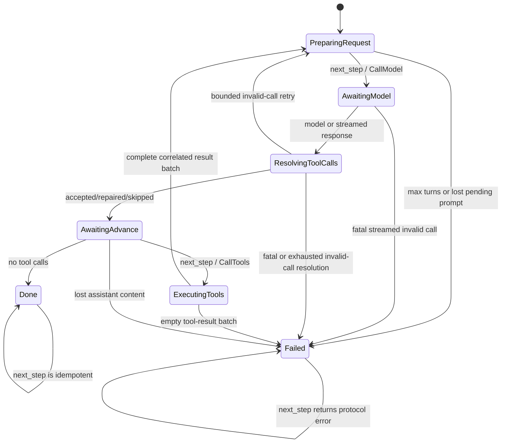
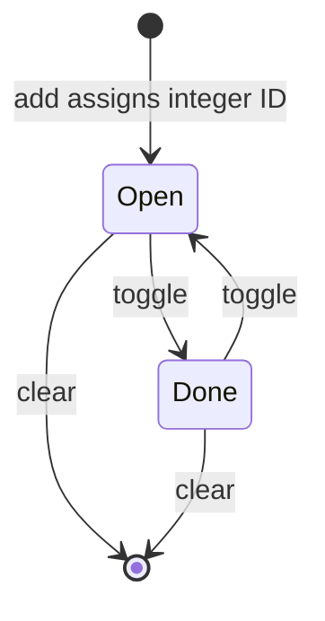
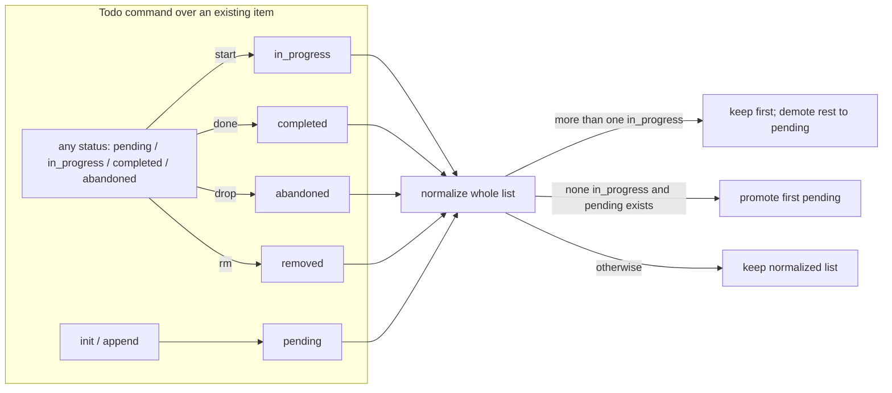
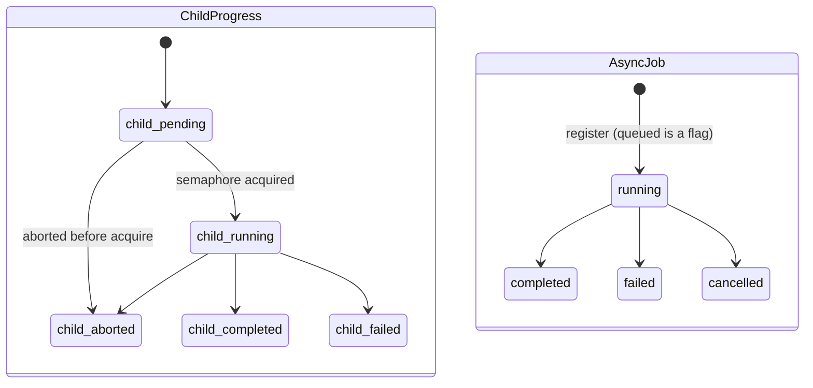
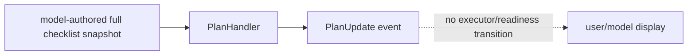
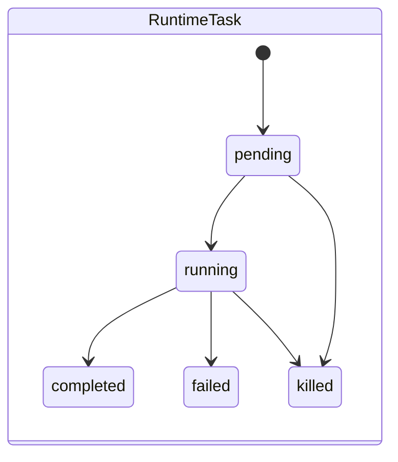
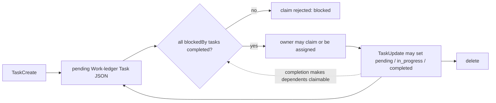

# Task, Todo, and Workflow state comparison

**Research date:** 2026-07-22 (Asia/Taipei)  
**Status:** Reviewed  
**Umbrella revision:** 1  
**Current Rollshot revision:** `dbaf22bb99d55cc39b1983aebdd8baaad26bb56d`  
**Reference revisions:** Pi `dd6bea41efa8caa7a10fe5a6401676dc5699f83f`;
oh-my-pi `7b141199d524b859c357fc89654f10b62b9f3df1`; Codex
`4a443994bd12f49f2f08b21a2f224d9d42b9e734`; Claude Code source
`2ca5ddabfed5f220812ea11f029eda03b21bc4c1`; Rig consumed by Rollshot
`0.39.0` (lockfile checksum recorded in the Round 0 baseline).  
**Evidence mode:** static source and test-source inspection. No provider, UI,
process-restart, task-race, or long-running workflow was executed.

This comparison applies the approved Checkpoint 1 vocabulary. It compares
implemented behavior, not names, and does not select a final Rollshot
foundation.

## 1. Rollshot problem statement and workload evidence

Rollshot currently has a strong bounded **Agent Run** but no foundation-owned
**Product Task** record or **Workflow**. That is sufficient for one Smart
Redaction authoring loop: one in-memory run serially alternates model and tool
work, then returns a typed review or failure terminal. Validation and dry-run
attempts are budget counters inside that run, not durable Product Task
attempts. [E:R1, R2]

The workload ladder applies different pressure and must not be collapsed into
one requirement:

| Workload | Observed state today | What this comparison may infer |
|---|---|---|
| Smart Redaction | **Evidence [W1]:** the app owns consent, one session value, a finite budget, cancellation, the spawned run, live activity, and the resulting review proposal; `AgentRunner` owns one serial bounded run. | **Inference [I:W1]:** a durable Task/DAG is not established as necessary. A small Product Task identity could improve review/provenance/retry accounting without changing serial execution. |
| Action Guide | **Evidence [W2]:** `ProjectManifestV2` durably stores a revision, frames, ordered steps, captions and annotations; save rejects revision conflicts. Visual-annotation input binds `run_id`, a reviewed step and `document_state_id`; caption work creates a typed `CaptionProposal`. | **Inference [I:W2]:** if future orchestration owns several suggestions, it needs stable project-revision and step/artifact references plus stale-result rejection. Current independent bounded tasks do not prove a DAG or parallel requirement. |
| Deferred brag + Hyperframes | **Evidence [W3-W6]:** brag gates inspect → plan artifact → Hyperframes check → MP4/poster/share-copy. Hyperframes describes stages by dependencies; audio may overlap frame work, install precedes parallel work, and worker completion is an expected file artifact with one clean re-dispatch. Collaborative mode pauses at plan/sketch checkpoints; autonomous mode posts summaries and continues. Every mode still requires explicit approval before render. | **Inference [I:W3-W6]:** if Rollshot adopts this deferred workload, it pressures durable dependency readiness, checkpoint decisions, external Job handles, artifact-gated completion, bounded fan-out and selective retry. It does not mandate video generation or that these records live in `rollshot-agent`. |

## 2. Terminology and non-equivalent concepts

The canonical units are qualified as follows:

| Term | Meaning used here |
|---|---|
| **Product Task** | A bounded host/product work unit. Durability, ID, owner, dependencies, attempts, executor and output contract are independent attributes. |
| **Todo** | Advisory checklist/reminder state. Persistence or branch-awareness does not make it executable work state. |
| **Work-ledger Task** | A coordination record for assigned work. It may be durable and dependency-aware without automatically launching runtime activity. |
| **Runtime Task** | A live activity/process/agent registry entry. Its lifecycle and output handles do not by themselves define product intent or dependency readiness. |
| **Workflow** | Host-owned multi-unit progression with explicit transition or next-step responsibility. A dependency graph is an optional shape, not the definition. |
| **Job** | Detached/external execution lifecycle: start, observe, cancel, collect, clean up and, where supported, reattach. It is not a Child Agent. |
| **Agent Run** | One bounded model/tool execution lifecycle. A Run is not automatically a Product Task or Workflow. |
| **Artifact** | A named product completion output. A log, transcript item, path, child notification or tool result remains output/evidence until a product contract promotes it. |
| **Recovery** | Always qualified below as conversation reconstruction, Product Task/workflow recovery, child-context resume, Job/process reattachment, or transport resume. |

Four distinctions are load-bearing:

1. **Sequential-only execution is valid.** Rollshot's current serial bounded
   run and a serial Hyperframes fallback are not deficient versions of a DAG.
2. **Flat Todo is not execution.** Pi's example, oh-my-pi Todo, Codex
   `update_plan`, and Claude's legacy Todo store reminders/checklists.
3. **A durable Work-ledger Task is still not a Runtime Task.** Claude Code's
   JSON record coordinates ownership and blockers; its root runtime Task map
   separately owns live shell/agent activity.
4. **Dependency-aware is not synonymous with Workflow execution.** Claude's
   blockers gate claiming, but ready ledger items do not automatically spawn
   Runtime Tasks. A future Rollshot Workflow would need an explicit owner for
   readiness-to-execution transitions.

## 3. Current Rollshot behavior

At current Rollshot HEAD, the investigated foundation still has the Round 0
shape; the scoped `rollshot-agent`, Action Guide project, and timeline-agent
paths have no diff from the Round 0 Rollshot revision. `AgentTaskProfile` only
selects prompts and terminal tools; it is not a Product Task record. [E:R1,
R2, W1, W2]

The actual in-memory run wraps Rig 0.39's serializable sans-I/O machine, but
Rollshot neither serializes it nor exposes it as a durable contract:

`Failed` is Rig's terminal/poison state for fatal paths: `next_step` first
replaces the current state with `Failed`, and explicit fatal streamed-call and
empty-result paths also assign it. Not every protocol misuse transitions to
`Failed`; out-of-order calls such as `next_step` while awaiting a model or
invalid-call decision return a protocol error while restoring or retaining the
expected state. [E:R3]

**Ownership:** Rig owns protocol phase, turn counting, conversation threading
and pending-call correlation. Rollshot's `AgentRunner` owns the driver,
provider facade, serial tool policy, budgets, cancellation and terminal
mapping; the app owns review state. **Persistence:** all of that active state
is memory-only. **Visibility:** transient `RunEvent`s feed the workbench, while
the typed terminal is authoritative. **Recovery:** Product Task/workflow or
agent-run recovery was **not found in the investigated scope** [A:R]. Action
Guide save/load is separate durable product-artifact persistence, not an agent
run checkpoint. [E:R1-R3, W2]

## 4. Per-system behavior

### 4.1 Pi: no built-in Task/Workflow; example-only branch Todo

Pi's active coding-agent has a sequential Agent run lifecycle with parallel or
serial tool-batch policy, durable conversation branches, and no built-in
Product Task/Workflow record in the focused roots. The only Task-comparison
state is an **uninstalled extension example**: integer ID, text, and `done`
boolean. Each operation stores a full snapshot in tool-result details; session
start/tree changes reconstruct the newest branch-appropriate snapshot. [E:P1]

The extension owns state, the JSONL conversation branch indirectly persists
snapshots, and the model/user sees it through the tool and `/todos` renderer.
Dependencies, owners, execution attempts and completion artifacts were **not
found in the investigated scope** [A:P]. This is branch-correct advisory state,
not a scheduler. [E:P1]

### 4.2 oh-my-pi: phased Todo, fan-out Task and process-local Job

oh-my-pi implements three relevant but deliberately separate machines. [E:O1-O3]

The Todo status values do not form a restricted legal-transition graph.
`start`, `done`, and `drop` overwrite any prior status, including completed or
abandoned; `rm` deletes an item of any status. Before the updated list is
returned, normalization keeps at most the first `in_progress` item and demotes
the rest, or promotes the first pending item when none is in progress. [E:O1]

Todo is phased but flat with respect to execution: normalization keeps at most
one literal `in_progress` item, and session tool-result/custom entries recover
the latest snapshot. `TaskTool` allocates child IDs, runs independent batch
items through a per-session semaphore, and returns usage, output paths,
patches, validation metadata and errors. `AsyncJobManager` owns detached bash
or Task records, progress, result/error text, completion-delivery retries and
retention in process memory. Provider retry attempt numbers and delivery retry
attempts are observable component counters; they are not a durable Product
Task attempt ledger. [E:O1-O3]

A Task batch is fan-out: all items share common context and independently wait
for capacity. Dependency edges, a Workflow ID and deterministic next-ready
node were **not found in the investigated scope** [A:O]. Child transcript cold
revival does not rehydrate the lost `AsyncJobManager` record after process
death. [E:O2, O3]

### 4.3 Codex: flat plan snapshots and a separate durable singleton Goal

Codex's built-in `update_plan` accepts an entire flat vector of
`Pending`/`InProgress`/`Completed` items and emits `PlanUpdate`. The handler
does not own item IDs, owners, dependencies, attempts, output or execution; it
also rejects use in Plan mode because Plan mode is a different concept. The
status values are model-supplied snapshot fields, not a host-enforced
transition graph. [E:C1]

Codex Goal is separate and durable in the state database. It owns `goal_id`,
objective, `active|paused|blocked|usage_limited|budget_limited|complete`, token
budget/usage and elapsed time. Model tools may create, read, and mark only
`complete`/`blocked`; user/system paths own pause/resume/limit transitions.
Goal governs a thread-level objective, not a list or Workflow. [E:C2]

A standalone Product Task/Workflow/Job state model and dependency readiness
were **not found in the investigated scope** [A:C]. `SessionTask` is internal
Tokio machinery and background terminals are live process handles; neither is
substituted into this matrix. [E:C3]

### 4.4 Claude Code: Runtime Task and dependency-aware Work-ledger Task

Claude Code makes the strongest distinction in the core set. [E:L1-L4]

Runtime Task is a root `AppState.tasks` entry for shell/agent/teammate and other
activities. It has a prefixed random ID, type, live status, abort/kill behavior,
session-scoped append-only output file, offsets, notifications and terminal
eviction. Its registry state is process memory even when its output file or
agent transcript persists. [E:L1, L2]

Work-ledger Task is one JSON file per item under a Task-list directory. It has
a stable monotonic string ID, subject/description, optional owner, status,
reciprocal `blocks`/`blockedBy` edges and metadata. File/list locks coordinate
creation, update and claim; watches, in-process signals and fallback polling
surface changes. Claiming rejects an unresolved blocker and may atomically
enforce one open task per agent. [E:L3]

The ledger is dependency-aware coordination, not an execution DAG:
`TaskUpdate` can replace status without an enforced legal-transition graph,
completion only changes readiness observed by later list/claim operations, and
no Runtime Task is spawned automatically. Per-item attempt, output, error and
artifact fields, plus cycle detection, were **not found in the investigated
scope** [A:L]. Task-tool call errors are responses, while runtime Task output
and failures remain in the separate activity layer. [E:L3, L4]

## 5. State and authority ownership

| System / unit | Owner | Persistence boundary | Execution authority |
|---|---|---|---|
| Rollshot Agent Run | **Evidence [R1-R3]:** `AgentRunner` + private Rig machine; app owns review. | **Evidence:** memory only; typed proposal may enter app/product state. | Registered Rollshot tools, finite budget and cancellation; serial batch policy. |
| Pi example Todo | **Evidence [P1]:** extension closure and tool. | **Evidence:** full snapshots in active conversation branch; memory if no persisted session. | None: model/user invokes reminder mutations; no executor. |
| oh-my-pi Todo / Task / Job | **Evidence [O1-O3]:** Todo tool/session; TaskTool and child sessions; process-global `AsyncJobManager`. | **Evidence:** Todo session snapshot and child transcripts can persist; live Task progress/Jobs/controllers/delivery queue do not survive process death. | Child tools/policies and semaphores; Job abort controller. Todo has none. |
| Codex plan / Goal | **Evidence [C1-C3]:** Plan handler/event; Goal extension + state DB. | **Evidence:** Goal is database-backed. Plan is an event/checklist, not a durable executor record. | Goal model tool has restricted transitions; plan has no execution authority. |
| Claude Runtime Task / Work ledger | **Evidence [L1-L4]:** root AppState Task registry vs task-list filesystem utilities/tools. | **Evidence:** runtime registry is live memory with separate output/transcript files; ledger JSON survives process exit. | Runtime implementation owns kill/abort. Ledger claim/assignment coordinates owners but does not launch work. |

Authority must remain separate from state visibility. A model's ability to
write a Todo or ledger record is not permission to execute a tool, mutate an
Action Guide, start a Job, publish an artifact, or approve a checkpoint.

## 6. Lifecycle and state-machine comparison matrix

Every cell is explicitly classified:

- **Evidence [E]**: positive static source evidence at the pinned revision.
- **Bounded absence [A]**: “not found in the investigated scope”; the audit ID
  supplies exact roots and regex. It is not proof of impossibility.
- **Inference [I]**: a conclusion derived from named evidence, not implemented
  behavior.

### Identity, dependencies, readiness and attempts

| System | IDs / owner | Dependencies | Parallel readiness | Attempts |
|---|---|---|---|---|
| Rollshot | **Evidence [E:R1]:** Session/Run IDs and proposal generation exist inside bounded product paths. **Bounded absence [A:R]:** a durable Product Task/Workflow ID and owner were **not found in the investigated scope**. | **Bounded absence [A:R]:** dependency fields/readiness were **not found in the investigated scope**. | **Evidence [E:R1,R2]:** one Agent Run, one serial tool batch at a time. **Inference [I:W1]:** this sequential-only shape satisfies current Smart Redaction. | **Evidence [E:R1]:** validation and dry-run attempt counts are run-budget dimensions. **Bounded absence [A:R]:** durable Product Task attempt records were **not found in the investigated scope**. |
| Pi | **Evidence [E:P1]:** example Todo uses extension-local integer IDs and its record contains only ID/text/done. **Bounded absence [A:P]:** built-in Task/Workflow identity and a Task owner were **not found in the investigated scope**. | **Evidence [E:P1]:** the example record has no dependency/owner fields. **Bounded absence [A:P]:** built-in Task/Workflow dependencies and ownership were **not found in the investigated scope**. | **Evidence [E:P1]:** the example tool only mutates advisory state; Pi tool batches can parallelize separately. **Bounded absence [A:P]:** a built-in parallel task scheduler/readiness record was **not found in the investigated scope**. | **Evidence [E:P1]:** the example record has no attempt field. **Bounded absence [A:P]:** a built-in durable Product Task attempt record was **not found in the investigated scope**. |
| oh-my-pi | **Evidence [E:O1-O3]:** Todo items use content identity; Task children and Jobs have IDs/owners. **Bounded absence [A:O]:** a shared Workflow ID was **not found in the investigated scope**. | **Bounded absence [A:O]:** `dependsOn`/`blockedBy`/Workflow dependency fields were **not found in the investigated scope**. | **Evidence [E:O2,O3]:** every Task batch item independently waits on a semaphore; queued Jobs do not consume a running slot. This is fan-out/capacity readiness, not dependency readiness. | **Evidence [E:O2,O3]:** transient provider retry attempt and completion-delivery attempt counters exist. **Bounded absence [A:O]:** a durable unified work-attempt ledger was **not found in the investigated scope**. |
| Codex | **Evidence [E:C2]:** Goal has durable `goal_id`, scoped to a Thread. **Bounded absence [A:C]:** plan-item IDs/owners and standalone Task/Workflow identity were **not found in the investigated scope**. | **Bounded absence [A:C]:** plan/Goal dependency edges were **not found in the investigated scope**. | **Evidence [E:C1]:** `PlanUpdate` only publishes a flat snapshot. **Bounded absence [A:C]:** task readiness/executor ownership was **not found in the investigated scope**. | **Bounded absence [A:C]:** plan/Goal attempt records were **not found in the investigated scope**; provider retries are separate Turn mechanics. |
| Claude Code | **Evidence [E:L1,L3]:** Runtime Task has random prefixed ID; Work-ledger Task has monotonic ID and optional owner. | **Evidence [E:L3]:** reciprocal `blocks`/`blockedBy`; unresolved blockers reject claim. **Bounded absence [A:L]:** cycle detection was **not found in the investigated scope**. | **Evidence [E:L3]:** independent unblocked items may be claimed by different teammates; readiness is evaluated on list/claim. **Inference [I:L3]:** this is parallel-ready coordination, not automatic scheduling. | **Bounded absence [A:L]:** per-ledger-item attempt records were **not found in the investigated scope**. Runtime output write retry is not a work attempt. |

### Outputs, errors, visibility and recovery

| System | Outputs | Errors / terminal state | Visibility | Recovery |
|---|---|---|---|---|
| Rollshot | **Evidence [E:R1,W1,W2]:** typed `ReadyForReview`, automation/proposal/evidence and Action Guide proposals/artifacts. | **Evidence [E:R1]:** cancelled, budget, validation, runtime, protocol and provider terminals are typed. | **Evidence [E:R1]:** transient workbench events may drop; terminal reconciliation is authoritative. | **Bounded absence [A:R]:** Product Task/workflow/agent-run recovery was **not found in the investigated scope**. **Evidence [E:W2]:** Action Guide product project save/load is separate recovery. |
| Pi | **Evidence [E:P1]:** Todo snapshots/tool text only. **Bounded absence [A:P]:** a typed completion Artifact contract was **not found in the investigated scope**. | **Evidence [E:P1]:** operation errors are returned in example tool details. **Bounded absence [A:P]:** a Product Task terminal contract was **not found in the investigated scope**. | **Evidence [E:P1]:** tool output and `/todos` render current branch snapshot. | **Evidence [E:P1]:** reconstruct Todo from the active session branch. **Bounded absence [A:P]:** interrupted Task/Workflow recovery was **not found in the investigated scope**. |
| oh-my-pi | **Evidence [E:O2,O3]:** `SingleResult` includes output, usage, paths, patches and validation; Job retains result/error text. | **Evidence [E:O2,O3]:** child completed/failed/aborted and Job completed/failed/cancelled; retry failure is visible. **Bounded absence [A:O]:** a common durable workflow terminal was **not found in the investigated scope**. | **Evidence [E:O1-O3]:** session Todo, Task progress/event bus, Hub list/poll/watch and Job delivery. | **Evidence [E:O1,O2]:** Todo reconstructs and child transcripts may revive. **Bounded absence [A:O]:** Job serialization/reattachment was **not found in the investigated scope**. |
| Codex | **Evidence [E:C1,C2]:** plan event and Goal objective/usage. **Bounded absence [A:C]:** a Product Task/Artifact output contract was **not found in the investigated scope**. | **Evidence [E:C2]:** Goal includes blocked/limit/complete. **Bounded absence [A:C]:** a plan-item error state and Product Task terminal contract were **not found in the investigated scope**. | **Evidence [E:C1,C2]:** `PlanUpdate` event; goal get/update events and state DB. | **Evidence [E:C2]:** Goal survives through state DB. **Bounded absence [A:C]:** Workflow recovery was **not found in the investigated scope**; Thread/process/transport resume are separate layers. |
| Claude Code | **Evidence [E:L1-L4]:** Runtime Task has output files/deltas; Work ledger stores description/status/metadata. **Bounded absence [A:L]:** a durable ledger output/artifact reference was **not found in the investigated scope**. | **Evidence [E:L1]:** Runtime Task failed/killed terminals. **Bounded absence [A:L]:** durable ledger error/result fields were **not found in the investigated scope**. | **Evidence [E:L2,L3]:** runtime SDK/UI events and output deltas; ledger tools, filesystem watch, signal and poll. | **Evidence [E:L3]:** ledger JSON survives restart. **Bounded absence [A:L]:** generic Runtime Task resurrection was **not found in the investigated scope**; explicit local-agent/remote paths are narrower. |

## 7. Persistence and recovery consequences

Conversation persistence is not Workflow recovery. Pi and oh-my-pi can
reconstruct branch state; Codex can reconstruct a Thread and Goal; Claude can
reload ledger JSON. None of those facts recreates an in-flight provider
stream, tool future, approval prompt, process controller or external Job unless
that narrower layer explicitly supports it. [E:P1, O1-O3, C2-C3, L1-L4]

The persistence design changes failure semantics:

- Rollshot's current typed terminal is locally strong but disappears with the
  live run; the durable review/project artifact is owned outside it. [E:R1,W2]
- A snapshot Todo can be reconstructed but cannot identify whether work was
  attempted, succeeded, or merely marked done by the model. [I:P1,O1,C1,L4]
- Claude's work ledger preserves intent/ownership/readiness after restart, but
  the runtime activity and output still require correlation. Its reciprocal
  edge updates span separate files, so crash consistency is a question for a
  Rollshot design, not a property to copy implicitly. [E:L3; I:L3]
- oh-my-pi demonstrates useful live Job observation, but its process-local
  manager cannot satisfy restart reattachment for a render/cloud job. [E:O3]

## 8. Parallelism and scheduling

Three different forms of parallelism appear:

1. **Tool-call parallelism** in Pi/Codex/Claude is inside one model turn and is
   irrelevant to durable Work-ledger readiness.
2. **Fan-out child parallelism** in oh-my-pi runs all independent batch items
   behind a semaphore; there are no predecessor edges.
3. **Dependency-aware coordination** in Claude permits independent ready items
   to be claimed by different teammates, but a human/model/tool still bridges
   “ready” to “running.”

Hyperframes preserves a fourth valid mode: serial inline fallback. A
concurrency cap changes waves, not the work list, and completion is verified by
the expected artifact rather than child notification. [E:W5] A Rollshot design
must therefore represent `ready` separately from `running` and keep scheduling
policy (serial, bounded parallel, external Job) separate from dependency
semantics. [I:W4-W6]

## 9. Failure, cancellation and retry

Current Rollshot cancellation and terminals are appropriate for one run.
oh-my-pi adds live child/Job cancellation and component retries. Claude adds
ledger blocker rejection and runtime kill. None of the core systems supplies a
single durable attempt model that combines input revision, execution lease,
retry reason, output artifacts, cancellation intent and successor readiness.
[E:R1,O2,O3,L1,L3; A:R,A:P,A:O,A:C,A:L]

For the deferred Hyperframes workload, “one clean re-dispatch” is a new
attempt only after the expected artifact is missing. A notification failure is
not automatically an execution failure. [E:W5] For Action Guide, a late result
against a changed document revision should be rejected, not blindly retried.
[I:W2] These are different retry policies and should not be hidden inside a
generic `failed -> pending` transition.

## 10. Security and privacy

- A durable Product Task or Workflow record should persist opaque IDs,
  authorized artifact references, revision/provenance, policy snapshots and
  sanitized errors—not screenshot bytes, full prompts or provider transcripts
  by default. [I:W1,W2]
- Todo/checklist text is model-visible and often transcript-persisted. It must
  not become an authority token or silently carry sensitive screenshot
  content. [E:P1,O1,C1,L4; I]
- Task owner and readiness do not grant tool, filesystem, capture, network or
  publishing authority. Authorization must be checked when a Runtime
  Task/Job starts and again when a reviewed artifact is applied/published.
  [I:R1,W2,W6]
- Shared-file parallel workers can race or expose artifacts. Hyperframes avoids
  shared conversational state and verifies expected files, but that is a
  workload contract, not a sandbox. [E:W5]

## 11. Alternatives and trade-offs

### Candidate pattern A — bounded Product Task envelope, sequential execution

Add a small Rollshot-owned Product Task record around the existing bounded
Agent Run. A possible record would contain Task ID/type, authorized input and
project/document revision references, status, one or more explicit attempt
summaries, typed terminal, review Artifact reference, timestamps and sanitized
error. The app remains the owner; one Task executes at a time; dependencies,
Job scheduling and child fan-out remain absent. [I:R1,W1,W2]

**Trade-offs:** smallest change and closest to Smart Redaction; makes retries,
stale-result checks and review provenance explicit; does not force Todos or
conversation transcripts into execution state. It cannot natively express
Hyperframes stage readiness, checkpoint gates or overlapping external Jobs.
Adding unused dependency fields would weaken its simplicity.

### Candidate pattern B — durable Workflow/work ledger plus separate attempts and Jobs

Introduce a Rollshot-owned Workflow instance containing stable Work Item IDs,
explicit predecessors, checkpoint decisions and expected Artifact contracts.
Keep Runtime Attempt records and external Job handles separate: readiness is a
deterministic projection from predecessors/checkpoints/artifacts; a scheduler
leases ready items serially or with a bounded cap; each attempt records input
revision, authority/budget snapshot, terminal/error and produced artifacts.
[I:L3,W3-W6]

**Trade-offs:** directly represents the deferred multi-stage workload and can
coordinate independent Action Guide work if the product later needs it. It
also introduces graph validation, cycle policy, atomic persistence, leases,
idempotency, crash reconciliation, checkpoint UI, retention, migration and
privacy surface. Claude's ledger is useful coordination evidence but does not
provide the separate durable attempt/Job/artifact layer this candidate would
need.

### Candidate pattern C — product-owned staged ledger without a general scheduler

Action Guide or a future media feature may own a domain-specific ordered/staged
ledger in its project artifact, while the agent foundation continues to expose
only bounded Product Task/Attempt contracts. The product deterministically
chooses the next stage and may call an external Job service; no generic DAG
engine is added to `rollshot-agent`. [I:W2-W6]

**Trade-offs:** keeps product semantics close to durable artifacts and avoids a
general platform. Cross-product scheduling, event aggregation and recovery may
be duplicated if several workloads converge on the same needs. This remains
materially distinct from both a single sequential Task and a generic Workflow
engine.

## 12. Preliminary Rollshot fit without final selection

| Candidate | Smart Redaction | Action Guide | Deferred brag + Hyperframes |
|---|---|---|---|
| A: bounded Product Task | **Inference:** natural fit; preserves typed review and serial execution. | **Inference:** fits independent caption/visual proposal tasks when bound to project revision. | **Inference:** insufficient alone for dependencies/checkpoints/Jobs. |
| B: Workflow + Work Items/Attempts/Jobs | **Inference:** capable but likely more state than this workload proves. | **Inference:** useful only if product orchestration across many steps becomes real. | **Inference:** strongest semantic match if the deferred workload is adopted. |
| C: domain-staged ledger | **Inference:** unnecessary for one run. | **Inference:** can extend existing durable project state without moving all semantics into the agent crate. | **Inference:** can encode one product workflow, with less reuse than B. |

No candidate is selected here. Synthesis must decide whether the deferred
workload justifies Workflow complexity, whether Action Guide needs foundation
orchestration at all, and whether Product Task persistence belongs in the app,
a shared product service, or `rollshot-agent`.

## 13. Evidence gaps and required spikes

1. Runtime-test Claude ledger concurrent edge updates, crash between reciprocal
   file writes, blocker cycles, stale owners and claim fairness before treating
   it as a durability model rather than a coordination reference.
2. Runtime-test oh-my-pi process death during a Job and child cold revival;
   confirm exactly which IDs/results survive and which controllers do not.
3. Define Rollshot's minimum Product Task/Artifact retention and privacy policy
   before persisting Smart Redaction or Action Guide state.
4. Decide with product evidence whether Action Guide ever needs multi-item
   orchestration; current code proves durable projects and independent bounded
   proposals, not parallel/DAG demand.
5. If deferred media work becomes active, spike one dependency chain with an
   external Job and expected-artifact recovery. Measure whether a
   domain-specific ledger suffices before introducing a generic Workflow.
6. Static inspection did not execute any task transition, crash, watcher,
   semaphore, provider retry, or recovery path. Server/account/build-gated
   behavior remains outside this comparison.

### Bounded absence audit definitions

- **[A:R] Rollshot current foundation.** Roots:
  `crates/rollshot-agent/src/{domain,driver,model,provider,runtime,tools}.rs`.
  Regexes:
  `^(pub\s+)?(struct|enum|trait|type)\s+(Task|Todo|Workflow|Job)\b` and
  `depends[_ -]?on|dependency|workflow[_ -]?id|job[_ -]?id|attempts?|retry|resume|checkpoint`.
  No Task/Todo/Workflow/Job domain declaration, dependency/Workflow identity,
  durable attempt or recovery record was found; attempt hits were current-run
  validation/dry-run budget counters and retry prose/tests. Therefore those
  concepts were **not found in the investigated scope**.
- **[A:P] Pi built-in boundary.** Roots: `packages/agent/src`,
  `packages/coding-agent/src/core`, and coding-agent `sessions.md`,
  `session-format.md`, `extensions.md`, all under `learn-projects/pi`, excluding
  vendored HTML renderer code. Four case-insensitive regex groups were rerun:
  (1) declarations/identity/dependencies
  `^(export\s+)?(type|interface|class|enum)\s+(Task|Workflow|Job)\b|task(Id|Status|Owner)|workflow(Id|Status)|dependsOn|blockedBy`;
  (2) ownership/readiness/scheduling/attempts
  `task.?owner|owner.?task|ready|readiness|scheduler|scheduleTask|task.?queue|attempt(Id|s)?|retryCount|execution.?lease`;
  (3) completion contracts
  `typed.?artifact|artifact.?contract|expected.?artifact|task.?output|task.?result|task.?error|task.?terminal|terminal.?state`; and
  (4) Task/Workflow/Job-qualified recovery, matching either unit name within 40
  characters of
  `restore|resume|recover|rehydrate|reattach|resurrect`. Groups 1, 3, and 4
  returned no matches. Group 2 returned provider/session retry, message-queue,
  file-refresh, and unrelated “already/ready” hits, not a Task owner, scheduler,
  readiness, attempt, or lease record. Thus the matrix's built-in identity,
  owner/dependency, scheduler/readiness, attempts, typed completion Artifact,
  terminal, and interrupted-work recovery concepts were **not found in the
  investigated scope**. The broader Round 1 Pi profile audits [A1, A3, A4,
  A5, A9] cover the same boundary; separately inspected
  `examples/extensions/todo.ts` is positive example evidence, not part of this
  absence claim.
- **[A:O] oh-my-pi dependency/durability boundary.** Roots:
  `learn-projects/oh-my-pi/packages/coding-agent/src/{task,async,goals}` and
  `src/tools/todo.ts`. Focused case-insensitive regex groups were
  `dependsOn|depends_on|blockedBy|blocked_by|workflowId|workflow_id|\bDAG\b|next.?ready|readiness|scheduler`,
  `attempt(Id|s)?|retryCount|execution.?lease|leaseId|idempotenc`, and
  `workflow.?terminal|terminal.?workflow|WorkflowTerminal|TaskTerminal|terminalState|terminalStatus|typed.?artifact|artifact.?contract|expected.?artifact`.
  The dependency/readiness and common-terminal groups returned no matches.
  Attempt hits were provider retry progress, Job completion-delivery retries,
  or implementation loops, not durable unified work attempts. A fourth search
  for `serialize|deserialize|recover|rehydrate|persist|resume|reattach|resurrect`
  in `src/async` and `src/task` found child-session/artifact revival and the
  live manager's `resumeDeliveries`, but no serialized `AsyncJob` manager state
  or restart reattachment. Therefore a Task/Goal/Todo dependency graph,
  Workflow identity/next-ready contract, durable unified attempt ledger,
  common durable Workflow terminal, and Job restart reattachment were **not
  found in the investigated scope**. Round 1 oh-my-pi profile audits [A1, A2,
  A4, A7] provide the wider semantic boundary.
- **[A:C] Codex task/workflow boundary.** Roots: `codex-rs/core/src`,
  `protocol/src`, `app-server/src`, and `ext`, under
  `learn-projects/codex`, Rust files only. Exact case-insensitive groups were:
  (1)
  `^(pub\s+)?(struct|enum|trait|type)\s+(Task|Todo|Workflow|Job)\b|depends_on|blocked_by|workflow_id`;
  (2)
  `task.?owner|owner.?task|task.?ready|readiness|task.?scheduler|workflow.?scheduler|task.?attempt|attempt.?task|retry_count|execution.?lease`;
  (3)
  `expected.?artifact|artifact.?contract|task.?output|task.?result|task.?error|task.?terminal|workflow.?terminal`; and
  (4) the same bidirectional Task/Workflow/Job-qualified recovery expression as
  [A:P]. Groups 1 and 4 returned no matches. Group 2 returned Windows sandbox
  and environment readiness plus provider retry counts; group 3 returned
  internal `SessionTaskResult`, not a Product Task output contract. Direct
  inspection of `plan_tool.rs`, `handlers/plan.rs`, Goal state/tool, and
  internal `SessionTask` confirmed the distinction. Thus a standalone Product
  Task/Workflow/Job record, owner/dependencies/readiness scheduler, plan/Goal
  attempts, Product Task output/terminal contract, and Workflow recovery were
  **not found in the investigated scope**. Round 1 Codex profile audits [A1,
  A4, A6] provide the wider boundary.
- **[A:L] Claude Work-ledger/Runtime Task boundary.** Roots: `src/Task.ts`,
  `src/utils/tasks.ts`, `src/utils/task/{framework,diskOutput}.ts`, `src/tasks`,
  and Task Create/Get/List/Update tool directories, all under
  `learn-projects/claude-code-source-code`; recovery also covered
  `src/tools/AgentTool` and `src/utils/{sessionRestore,sessionStorage}.ts`.
  The ledger-field regex was
  `attempt(Id|s)?|retryCount|executionLease|leaseId|output(Path|Id|Ref)?|result(Field|Text|Ref)?|error(Field|Text|Ref)?|artifact(Id|Ref|Path)?|terminal(State|Status)?`;
  the cycle regex was `cycle|acyclic|topolog|strongly.?connected`; the
  declaration regex targeted `Workflow|Job|AgentRun|Artifact`; and recovery
  used
  `(restore|resume)[A-Za-z]*(Task|Agent)|(Task|Agent)[A-Za-z]*(restore|resume)|reattach|resurrect|sidecar`.
  Exact `TaskSchema` inspection limits durable ledger fields to ID, subject,
  description, optional active form/owner, status, reciprocal edges, and
  optional metadata. Ledger-search `error`, `result`, and `outputSchema` hits
  belong to tool-call responses; no cycle hits or named domain declarations
  occurred. Recovery hits establish explicit local-agent resume and remote
  sidecar restoration, not generic Runtime Task resurrection. Therefore
  per-ledger attempts/output/error/artifact/terminal fields, blocker cycle
  detection, a general Workflow/Job entity, and generic Runtime Task restart
  resurrection were **not found in the investigated scope**. Round 1 Claude
  profile audits [A1, A3, A4] provide the wider boundary.

## 14. Evidence index

Graph-first checks on all four ignored reference roots returned zero nodes,
zero edges and zero files; bounded source inspection was therefore required.
Rollshot's graph did cover `AgentRunner`, `AgentSession`, terminals and Action
Guide paths and was used before direct source inspection.

| ID | Type | Status | Pinned source / symbol | Supports / limit |
|---|---|---|---|---|
| R1 | source + test source | current Rollshot | `crates/rollshot-agent/src/driver.rs`: `AgentTaskProfile`, `AgentRunner`, `RunTerminalState`; `runtime.rs`: budgets/events/cancellation; `tools.rs`: registry/context | Bounded serial run, attempts as budget counters, typed terminal. Static; no live provider/UI. |
| R2 | source + graph | current Rollshot | `domain.rs::AgentSession`; graph file summaries and callers; six-file bounded audit [A:R] | In-memory session and absence boundary. |
| R3 | source | Rig 0.39 consumed source | `/home/noah/.cargo/registry/src/index.crates.io-1949cf8c6b5b557f/rig-core-0.39.0/src/agent/run/mod.rs`: `RunState`, `next_step`, invalid-call resolution, `tool_results`, serialization warning | Exact private phases including terminal `Failed`, fatal/error paths, and state-preserving protocol errors; local registry path is machine-specific and Rollshot does not persist it. |
| P1 | example source + bounded audit | example only | Pi `packages/coding-agent/examples/extensions/todo.ts`; built-in roots in [A:P] | Branch-reconstructed Todo and built-in absence. Tests/runtime not executed. |
| O1 | source | built-in | oh-my-pi `packages/coding-agent/src/tools/todo.ts`: `TodoStatus`, `applyEntry`, normalization, session reconstruction | Flat/phased Todo transitions and persistence. |
| O2 | source | built-in; async/isolation setting-dependent | oh-my-pi `src/task/{types,index,executor}.ts`: `AgentProgress`, `SingleResult`, semaphore/background registration | Child lifecycle, fan-out, outputs/errors/retry visibility. |
| O3 | source | built-in, process-local | oh-my-pi `src/async/job-manager.ts`: `AsyncJob`, `register`, `cancel`, delivery/retention | Job state/visibility and process-local boundary; no restart run. |
| C1 | source | built-in | Codex `protocol/src/plan_tool.rs`; `core/src/tools/handlers/plan.rs` | Flat checklist snapshot/event; no enforced transition/executor. |
| C2 | source | app-server Goal integration, state-DB dependent | Codex `state/src/model/thread_goal.rs`; `ext/goal/src/tool.rs`; app-server extensions | Durable singleton Goal identity/status/usage and authority split. |
| C3 | source + bounded audit | built-in | Codex core Session/internal task/background-terminal sources; [A:C] | Internal runtime versus Product Task/Workflow absence; no runtime recovery test. |
| L1 | source | implemented default | Claude `src/Task.ts`; concrete task implementations | Runtime Task ID/status/base fields and terminal set. |
| L2 | source | implemented default | Claude `src/utils/task/{framework,diskOutput}.ts` | Root registry events, output deltas/files, terminal eviction; live state is in memory. |
| L3 | source | interactive default Tasks v2 | Claude `src/utils/tasks.ts`; Task Create/Get/List/Update tools | Durable ledger ID/owner/dependencies/locks/readiness and direct status update. No crash/race run. |
| L4 | source | selected legacy/noninteractive path | Claude `src/utils/todo/types.ts`; `src/tools/TodoWriteTool` | Separate flat Todo; surface enablement differs. |
| W1 | source + test source | current Rollshot product path | `crates/rollshot-app/src/result_workspace/workbench/{run,state,mod}.rs`; R1 | Smart Redaction ownership/review loop. UI/provider not executed. |
| W2 | source + test source | current Rollshot product path | `rollshot-action/src/project/{model,store,validate}.rs`; app timeline `visual_annotation_agent.rs`, `caption_agent.rs`, `update.rs` | Durable Action Guide revision/artifacts and bounded proposal inputs; active callsites and tests were inspected, but the UI/provider path was not executed. |
| W3 | source | deferred workload reference | brag `skills/brag/SKILL.md` steps 1-4/gates at `357a805e...` | Plan, check, render/poster/share-copy artifact gates; not Rollshot behavior. |
| W4 | source | deferred workload reference | Hyperframes `production-loop.md` at `807078c7...` | Dependency stages, background overlap and verify-before-deliver. |
| W5 | source | deferred workload reference | Hyperframes `subagent-dispatch.md` | Expected-artifact completion, cap/waves, one re-dispatch, serial fallback. |
| W6 | source | deferred workload reference | Hyperframes `review-loop.md` §§1-4 | Collaborative plan/sketch gates wait; autonomous summaries continue; all modes require explicit render approval. |

**Confidence:** high for visible source-defined state fields, owner boundaries,
positive transitions and pinned revisions; medium for bounded absences and
cross-file persistence consequences; low-to-medium for crash consistency,
server/build-gated behavior and any runtime property not exercised here.
Profiles were used for routing and contradiction awareness, but the focused
claims above were re-checked against their pinned sources.
